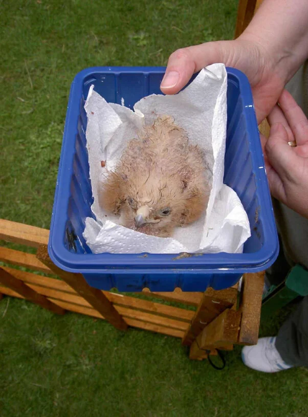
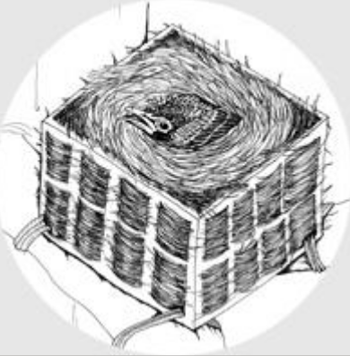
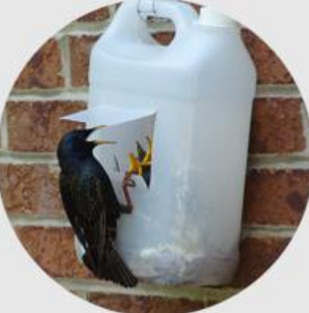

This guide is sourced from multiple organizations/websites.

**Contents**

- [PETA](#peta)
- [Mass Audubon](#mass-audubon)
- [Helpbabybirds.ca](#helpbabybirdsca)
- [Audubon.org](#audubonorg)
- [The Spruce](#the-spruce)
- [Greenwood Wildlife](#greenwood-wildlife)
- [Birdsanctuary.kbs.msu.edu](#birdsanctuarykbsmsuedu)
- [Tufts Wildlife Clinic](#tufts-wildlife-clinic)
- [DO NOT DISTURB MESSAGING](#do-not-disturb-messaging)

# PETA

**Create a Surrogate Nest**

If you can’t see or reach the original nest, make one out of a small basket, kitchen strainer, or small plastic container with holes punched in the bottom. Ideally the "nest” should be cereal-bowl shaped, well padded with tissue paper, and of a non-slippery material, otherwise the bird’s legs could spread out sideways and become deformed.

[Source](https://www.peta.org/action/how-to-save-baby-birds/)

# Mass Audubon

**How to Help Hatchlings and Nestlings**

If there's no nest, you can make one by fastening a container to a branch. A small basket is ideal, but you can use a plastic container such as a margarine tub and punch holes through the bottom. Sides should be no higher than 4 inches. Cut two pieces of wire to 18-inch lengths and thread them up through the bottom of the container and down again. Securely wire it to the top of a branch in the same tree or shrub as the nest, and line the container with dry grass. Place the bird inside the basket.

[Souce](https://www.massaudubon.org/nature-wildlife/birds/baby-birds-out-of-the-nest)

# Helpbabybirds.ca

**For replacing cup-shaped nests in trees, shrubs, or on eavestroughs or other flat surfaces:**

- Step 1: Obtain an open plastic container - a large margarine tub usually works well, or a berry basket - to use as the base for the new nest. Poke holes in the bottom if there are none to allow for moisture drainage.

- Step 2: Pack nesting material into the container. If you have remnants of the original nest, this is ideal. If not, use dry grass packed tightly into the container. Push the nesting material down in the middle and up around the sides to form a cup shape just large enough to contain the babies snugly.

- Step 3: Thread several pieces of wire into a hole on the bottom of the container and out through another hole. These will become fasteners that can be used to wire the new nest in the original nest location.

- Step 4: Attach the new nest to the location of the original nest if you can safely access it, or near it an area sheltered from direct sunlight and rain. It is important that the nest be as close as possible to the original since parent birds identify their babies by location. If you are not sure of the original location, look for signs such as remnants of nesting material or accumulation of feces to make your best guess.

- Step 5: Once the nest is securely in place, tuck the baby or babies firmly into it. Make sure that the babies are sitting upright with their legs tucked underneath them, and that the sides of the nest support the babies in this position.

- Step 6: Leave the area and monitor from a distance for 1-2 hours to see if the parents return to care for the babies. If there is no sign of any adults coming to the nest within that time period, contact a wildlife rehabilitator.

**For replacing nests built in crevices (e.g. vent shafts, holes in buildings):**

House sparrows and starlings, two common urban species, use this type of nest.

- Step 1: Obtain a large plastic jug - a windshield wiper fluid/antifreeze bottle works well. You can also use a gallon milk jug or two-litre pop bottle (though pop bottles are usually too small for a full nest of starlings). Make sure the container is thoroughly rinsed and dried.

- Step 2: Poke holes in the bottom to allow for moisture drainage.

- Step 3: Cut a square section on the side of the container 2-3 inches from the bottom. Only cut three sides of the square - the bottom and the two sides. Leave the top of the square attached, so that the cut flap can be pulled up from the bottle to form an awning. The square should be about two inches on all sides to allow the parent birds to perch on the edge and feed their young.

- Step 4: Pack nesting material into the container. If you have remnants of the original nest, this is ideal. If not, use dry grass packed tightly into the container. The nesting material should be packed in tightly to better support the babies. Push the nesting material down in the middle and up around the sides to form a cup shape just large enough to contain the babies snugly. The bottom of the "cup” should be about one inch below the bottom of the cut hole.

- Step 5: Secure a piece of wire around the top of the container (if it is a jug with a handle, wrap the wire around the handle. If not, poke two holes on opposite sides of the top of the jug and thread a piece of wire through). This wire will become a fastener that can be used to wire the new nest in the original nest location.

- Step 6: Attach the new nest as close you can to the entry point of the original nest if you can safely access it. (If possible, hang it right overtop of the original entrance point.) It is important that the nest be as close as possible to the original since parent birds identify their babies by location. If you are not sure of the original location, look for signs such as remnants of nesting material or accumulation of feces to make your best guess.

- Step 7: Once the nest is securely in place, tuck the baby or babies firmly into it. Make sure that the babies are sitting upright with their legs tucked underneath them. The babies should be sitting high enough that you can see their heads through the hole you have cut. Monitor from a distance for 1-2 hours to see if the parents return to care for the babies. If there is no sign of any adults coming to the nest within that time period, contact a wildlife rehabilitator.

# Audubon.org

If the nest is nowhere to be found or simply out of reach, just craft one yourself, Furr says. Find a small container, like a strawberry basket, and load it with a scrap of T-shirt or some straw—anything dry will do. Gently place the youngling inside, and affix the artificial nest in a tree close to where the bird was found. "You want to get it as high up as possible,” Furr says.

[Source](https://www.audubon.org/news/when-you-should-and-should-not-rescue-baby-birds)

# The Spruce

If you are unable to find the nest or it is unreachable or destroyed, line a small basket such as a pint berry basket with tissue or grass clippings and place it in the tree as close to the nest site as possible. Be sure the basket is secure (nail it to the tree if necessary) so the baby bird will not tumble out. The parent birds will hear their baby and find it easily, and since most birds have a poor sense of smell, they will not abandon it because it has been touched. It may take an hour or longer for wary adults to approach their baby again, but they will eventually resume caring for the youngster.

# Greenwood Wildlife

**What if the entire nest fell out of the tree, the nest cannot be found, or the nest is out of reach?**

If an intact nest has fallen out of a tree with babies, gather the nest and babies. Place the nest in a berry basket or other drainable container, then wire it securely to the tree it fell from.

If the nest is not intact or cannot be reached/found find an appropriately sized container to place the babies in: for example, a plastic berry container without a lid. The container must be able to drain water out of it. Place all of the nest material in the container. If you cannot find any part of the nest, make one yourself by lining the container with grass, hay, or straw. It is very important that the nest is able to drain completely. It is important that the nest is as close as possible to the original site since parent birds identify babies by location. Then wire it securely to that spot (at least 5 ft. above the ground).

You will need to observe the nest quietly from a distance for at least two hours to see if the parents return to feed the babies. If a parent returns, the babies are fine.

[Source](https://www.greenwoodwildlife.org/wildlife-emergency/i-found-an-animal/found-a-bird/found-a-baby-bird/altricial-birds/hatchling-or-nestling/)

# Birdsanctuary.kbs.msu.edu

There are different circumstances to consider depending on where you found the baby, what condition the baby is in, and how old the baby seems to be. If the baby is near the nest and doesn’t have many feathers, then it is best to put the baby back in its nest. It is just fine to touch them! Birds do not abandon their chicks if they happen to smell differently; that is a myth. If the nest is out of reach, be sure to put the baby out of harm’s way and within sight of the nest, and mom will do the rest! We were successful at the Sanctuary when a barn swallow nest fell and we were able to use some items on hand to contain the nest off the ground for mom and dad to care for the babies. 

# Tufts Wildlife Clinic

To make a replacement nest, take something like a cardboard box, basket, Cool Whip container, or Tupperware container and line it with grasses, torn up paper towels, newspaper, or the original nest material. Add a heat source such as a hot water bottle wrapped in a towel if possible.  Place the nest and heat source into a container with air holes and keep the car quiet (radio off) during transport.

[Source](https://vet.tufts.edu/tufts-wildlife-clinic/surrogate-bird-nest)

# DO NOT DISTURB MESSAGING

Birds are wildlife and taking a native bird from the wild is illegal without specific permitting from the state or federal government. Nature may seem harsh at times, yet only the strongest specimens survive. Birds will lay many eggs, so that there are more babies that may survive. Only 20% of birds will make it through their first year, and that’s all part of the circle of life. You can help by planting bird and insect friendly native plants in your own backyard! This will give the birds more options of food for feeding their young. Also, keep your pet cat indoors. [The American Bird Conservancy](https://abcbirds.org/program/cats-indoors/cats-and-birds/) reports that "in the United States alone, outdoor cats kill approximately 2.4 billion birds every year.”

Again, stop and think before moving a baby bird, this could be more harmful then helpful!