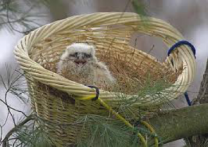
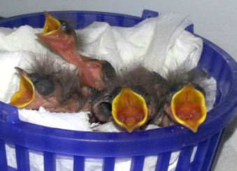
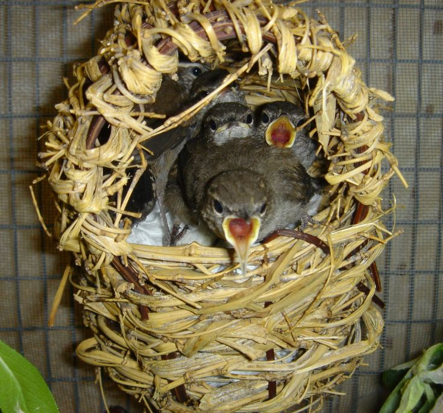

**Contents**

- [DO NOT DISTURB MESSAGING](#do-not-disturb-messaging)
- [Hatchling/Nestling](#hatchlingnestling)
  - [Replacement Nest](#replacement-nest)

# DO NOT DISTURB MESSAGING

Birds are wildlife and taking a native bird from the wild is illegal without specific permitting from the state or federal government. Nature may seem harsh at times, yet only the strongest specimens survive. Birds will lay many eggs, so that there are more babies that may survive. Only 20% of birds will make it through their first year, and that's all part of the circle of life. You can help by planting bird and insect friendly native plants in your own backyard! This will give the birds more options of food for feeding their young. Also, always keep your pet cat indoors or in enclosed catios.

Always stop and think before moving a baby bird, this could be more harmful than helpful!

# Hatchling/Nestling

If a caller has found a healthy hatchling/nestling, they should be instructed to place the bird back in its nest. If they cannot locate or reach the nest or the nest is damaged, they should make a replacement nest.

## Replacement Nest

Use a small wicker or berry basket, kitchen strainer, or small plastic container with holes punched in the bottom for drainage.  You can use laundry baskets for bigger birds. For most common songbirds, the "nest" should be cereal-bowl shaped, well padded with tissue paper and dry grass, and of a non-slippery material, otherwise, the bird's legs could spread out sideways and become deformed. Securely attach it with wire, bungee cord, tape, etc, to the top of a branch in the same tree or shrub as the nest. Do not feed the babies so the parent birds can find them by hearing their cries. Most birds have a poor sense of smell and will not abandon a baby because it has been touched, but you should always use gloves or a towel to handle wildlife when available. Observe quietly and from a distance, it may take a few hours for wary adults to approach their baby again, but they will eventually resume caring for the youngster.

**For replacing cup-shaped nests in trees, shrubs, or on eavestroughs or other flat surfaces:**

- Step 1: Obtain an open plastic container - a large margarine tub usually works well, or a berry basket - to use as the base for the new nest. Poke holes in the bottom if there are none to allow for moisture drainage.

- Step 2: Pack nesting material into the container. If you have remnants of the original nest, this is ideal. If not, use dry grass packed tightly into the container. Push the nesting material down in the middle and up around the sides to form a cup shape just large enough to contain the babies snugly.

- Step 3: Thread several pieces of wire into a hole on the bottom of the container and out through another hole. These will become fasteners that can be used to wire the new nest in the original nest location.

- Step 4: Attach the new nest to the location of the original nest if you can safely access it, or near it an area sheltered from direct sunlight and rain. It is important that the nest be as close as possible to the original since parent birds identify their babies by location. If you are not sure of the original location, look for signs such as remnants of nesting material or accumulation of feces to make your best guess.

- Step 5: Once the nest is securely in place, tuck the baby or babies firmly into it. Make sure that the babies are sitting upright with their legs tucked underneath them, and that the sides of the nest support the babies in this position.

- Step 6: Leave the area and monitor from a distance for 1-2 hours to see if the parents return to care for the babies. If there is no sign of any adults coming to the nest within that time period, contact a wildlife rehabilitator.

**For replacing nests built in crevices (e.g. vent shafts, holes in buildings):**

House sparrows and starlings, two common urban species, use this type of nest.

- Step 1: Obtain a large plastic jug - a windshield wiper fluid/antifreeze bottle works well. You can also use a gallon milk jug or two-litre pop bottle (though pop bottles are usually too small for a full nest of starlings). Make sure the container is thoroughly rinsed and dried.

- Step 2: Poke holes in the bottom to allow for moisture drainage.

- Step 3: Cut a square section on the side of the container 2-3 inches from the bottom. Only cut three sides of the square - the bottom and the two sides. Leave the top of the square attached, so that the cut flap can be pulled up from the bottle to form an awning. The square should be about two inches on all sides to allow the parent birds to perch on the edge and feed their young.

- Step 4: Pack nesting material into the container. If you have remnants of the original nest, this is ideal. If not, use dry grass packed tightly into the container. The nesting material should be packed in tightly to better support the babies. Push the nesting material down in the middle and up around the sides to form a cup shape just large enough to contain the babies snugly. The bottom of the "cup" should be about one inch below the bottom of the cut hole.

- Step 5: Secure a piece of wire around the top of the container (if it is a jug with a handle, wrap the wire around the handle. If not, poke two holes on opposite sides of the top of the jug and thread a piece of wire through). This wire will become a fastener that can be used to wire the new nest in the original nest location.

- Step 6: Attach the new nest as close you can to the entry point of the original nest if you can safely access it. (If possible, hang it right overtop of the original entrance point.) It is important that the nest be as close as possible to the original since parent birds identify their babies by location. If you are not sure of the original location, look for signs such as remnants of nesting material or accumulation of feces to make your best guess.

- Step 7: Once the nest is securely in place, tuck the baby or babies firmly into it. Make sure that the babies are sitting upright with their legs tucked underneath them. The babies should be sitting high enough that you can see their heads through the hole you have cut. Monitor from a distance for 1-2 hours to see if the parents return to care for the babies. If there is no sign of any adults coming to the nest within that time period, contact a wildlife rehabilitator.

Further info on how to make a nest: [Making A Nest](Making-A-Nest)