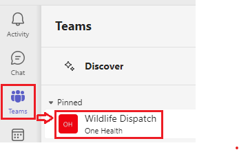
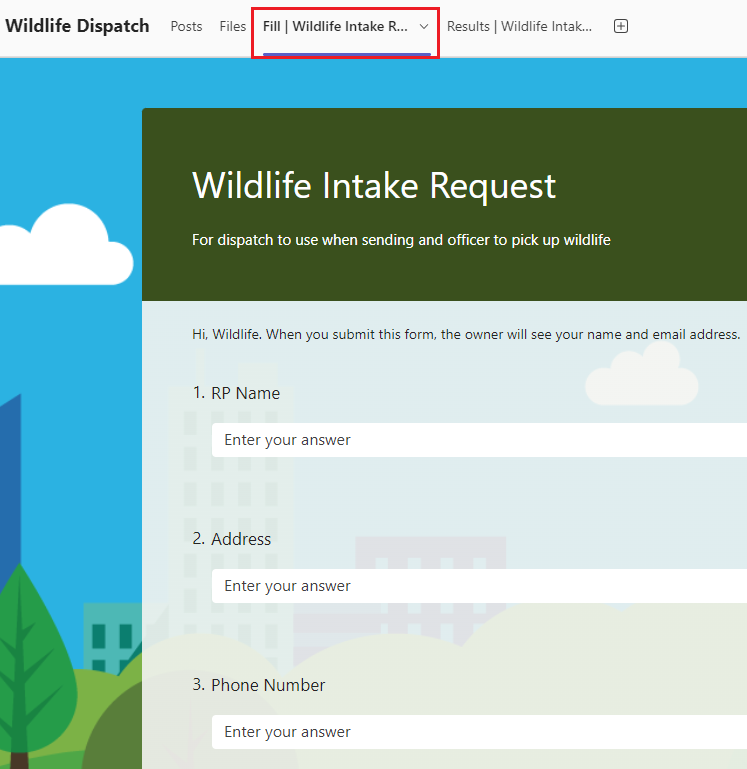

# How to Request ACO Dispatch

Follow these steps in the computer.

1. Go to Microsoft Teams.

2. In the left panel menu, click `Teams` -> `Wildlife Dispatch`. 
   
   `Wildlife Dispatch` is found under the `Pinned` section or nested under `Your teams` -> `One Health`.

3. At the top panel, click `Fill | Wildlife Intake Request`.

4. Fill out the form and then click `Submit`. Once submitted, the request will automatically show up in `Posts`. Wildlife Dispatch will react :thumbsup: or comment to confirm they have received the request.