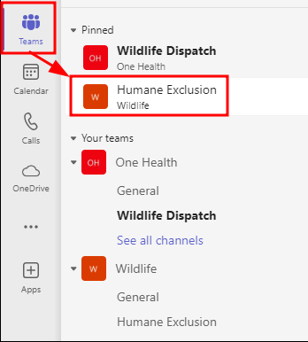
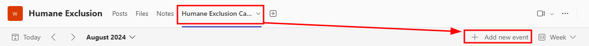
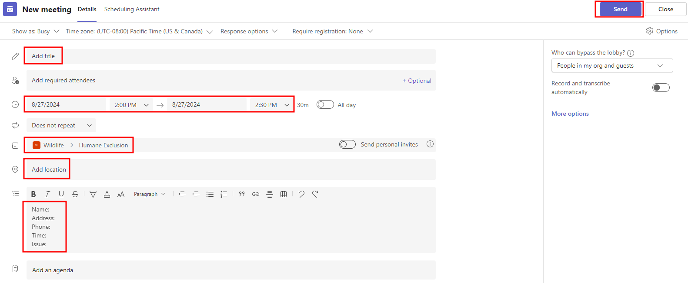
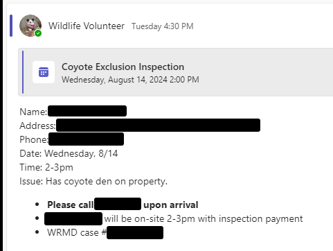
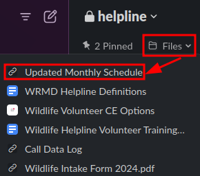

# How to Request Humane Exclusion

Follow these steps in the computer. Review the [scheduling](#scheduling) checklist before creating appointments.

1. Go to Microsoft Teams.

2. In the left panel menu, click `Teams` -> `Humane Exclusion`.

   
   `Humane Exclusion` is found under the `Pinned` section or nested under `Your teams` -> `Wildlife`.

3. At the top panel, click `Humane Exclusion Calendar` -> `Add new event`.

4. Fill out the New meeting form. 

   Required fields:

   - Title
   - Date/time
   - Location
   - Details
      - Name
      - Address
      - Phone
      - Date
      - Time
      - Issue
      - Additional relevant details

   **NOTE:** The invitations field should default to `Wildlife > Humane Exclusion`.

5. Click `Send`. Then the request will automatically show up in `Posts`.

## Scheduling

- Check technicians' availability in the Slack calendar:

   Slack -> `helpline` channel -> Files -> `Updated Monthly Schedule`

- Aim for **Tuesdays** (no Sundays unless there are 3 people)
- 4-hour minimum window