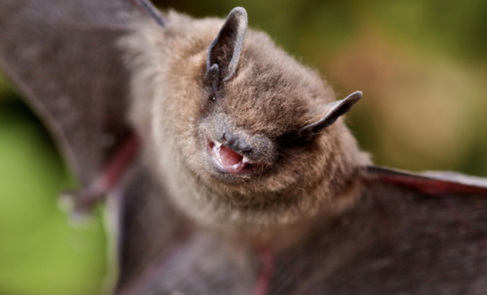

*It can be distressing when a bat is discovered in a living space; help the caller understand what needs to be done to resolve their concerns.*

**Contents**

- [Relevant Natural History](#relevant-natural-history)
- [Bat Seen in Daytime](#bat-seen-in-daytime)
- [Bat Acting Sick](#bat-acting-sick)
- [Bat Found on the Ground](#bat-found-on-the-ground)
- [Found a Baby Bat](#found-a-baby-bat)
- [Pet Bitten by Bat](#pet-bitten-by-bat)
- [Person Bitten by Bat](#person-bitten-by-bat)
- [Bat in the House (Inside Living Space)](#bat-in-the-house-inside-living-space)
- [Bat in Attic or Walls](#bat-in-attic-or-walls)
- [Bat Hanging Under House Eaves](#bat-hanging-under-house-eaves)
- [Bat Behind Shutters](#bat-behind-shutters)
- [Guano (Bat Droppings) on Siding or Porch](#guano-bat-droppings-on-siding-or-porch)

# Relevant Natural History

Bats have been plagued by centuries of superstitions, but they are actually one of nature's more gentle creatures. They are also very beneficial: A single bat can consume up to 500 insects in just one hour, and a colony of 100 little brown bats can consume more than a quarter of a million mosquitoes and small insects each night! That's why many people put up bat houses. Helping bats is increasingly important because white-nose syndrome has devastated their populations worldwide. Bats also pollinate crops we depend on, such as bananas, mangos, peaches and agave, while devouring huge numbers of crop-destroying insects. Perceived problems arise, however, when bats take up residence in attics and other dwellings to raise young. But people need not panic - there are humane ways to exclude bats.  

# Bat Seen in Daytime

**ADVICE:** Bats are nocturnal, but they may be seen during the day, especially during the early morning and evening. Unless the bat appears injured or sick (no fear of humans, aggressive, agitated), instruct the caller to leave the bat alone. 

# Bat Acting Sick

**ACTIONABLE:** If the bat shows no fear of humans, appears aggressive or agitated, or shows signs of physical impairment, she could be sick. Instruct the caller to keep pets and children away and dispatch an officer.  

# Bat Found on the Ground

**ADVICE:** If the caller finds a bat on the ground outside, it doesn't mean the bat is rabid. She may be sick, temporarily stunned from flying into a window, too chilled to fly (if the weather is colder) or "grounded" (most bats cannot take flight from the ground and need to launch off a high wall or branch in order to get lift).

Bats are not aggressive, but they may bite if handled or provoked. If the caller is willing to move the bat, ensure the caller knows not to touch the bat bare-handed. If the bat can be safely contained, instruct the caller to put on leather or thick gloves, then cover the bat with a small box or plastic container. Slip a cardboard or plastic cover between the ground and the container and lift the bat to a tree branch or high wall. 

**ACTIONABLE:** If the caller is unwilling to move the bat, or if they try placing the bat on a branch or wall and the bat drops to the ground, they should return the bat to the container and wait for assistance. While waiting, they should make sure the bat cannot escape from the container (if she's captured) and that there are small holes (no bigger than a half inch) in the container that let the bat breathe. They should also make sure that the container does not get too hot or too cold. Dispatch an officer or licensed wildlife rehabilitator to assess the bat. 

**ACTIONABLE:** If the caller moves the bat and he is still in the same spot for 24 hours, dispatch an officer to assess. 

# Found a Baby Bat

**ACTIONABLE:** The mother may have dropped the pup while flying or attempting to move her, or she may be orphaned. Dispatch an officer or refer the caller to a licensed wildlife rehabilitator to assess and pick up the bat. 

# Pet Bitten by Bat

**ACTIONABLE:** Instruct the caller to put on gloves and immediately confine the pet. If it is possible for them to do so safely and without touching the bat, instruct them to confine the bat by placing a box (such as a shoebox) or plastic container (with a few small air holes, no bigger than a half inch) over her so she can be captured and submitted for rabies testing. Instruct the caller to call their veterinarian for medical advice regarding their pet. Dispatch an officer to pick up (and capture, if necessary) the bat and submit her for testing. 

# Person Bitten by Bat

**ACTIONABLE:** Advise the caller to immediately wash the wound with soap and water and then call their physician and local health department. If the caller is willing, instruct them to wear leather or heavy gloves and capture the bat; instruct them to place a box or plastic container (with a few small air holes, no bigger than a half inch) over the bat so she can be easily captured and tested for rabies. Dispatch an officer to capture the bat and submit her for rabies testing.

# Bat in the House (Inside Living Space)

**ACTIONABLE:** If the caller cannot rule out exposure (i.e., bitten anyone or been in anyone's bedroom overnight), dispatch an officer to capture the bat and submit her for rabies testing.

**ACTIONABLE:** Sometimes a bat may accidentally find her way into a home. Advise them to avoid direct contact with the bat to help ensure that they don't get bitten (if the bat has bitten someone, see [Person Bitten by Bat](#person-bitten-by-bat)). If the bat is flying in the room, instruct the caller to stand back against the wall to avoid accidental contact with the bat. Tell the caller not to be alarmed; although it may feel like the bat is trying to "attack," she is just trying to maintain lift while flying. If the bat is not flying, and they cannot locate the bat, instruct the caller to check draperies or other places where the bat can hang easily.

If the caller is positive that the bat has not bitten anyone or been in anyone's bedroom overnight while they were sleeping or incapacitated, instruct them to confine the animal to one room and open a window or exterior door. The flying bat will locate the opening by echolocation and leave. Alternatively, and if the caller is willing, instruct them to wear leather or heavy gloves and capture the bat. Place a shoebox or similar container over the bat, then gently slide a piece of cardboard or plastic underneath. Then carry the bat outside for release, putting her on a tree branch or high wall (bats cannot fly up from the ground.)

Once the bat is removed, it's important for the caller to ascertain whether this was an accidental intrusion (which is common) or if there might be a colony living in a void within the house. If the latter, the first step is to seal up the home interior so that no more bats can access the living space. Advise the caller to contact a professional wildlife control company that specializes in bat eviction and exclusion services to identify whether a colony is present and develop a strategy for eviction and exclusion. The caller can also put up a bat house to provide alternate roosting sites (refer them to batcon.org for details).

# Bat in Attic or Walls

**REFERRAL:** Callers should hire a professional wildlife company experienced in bat eviction and exclusion if there are bats in their attic or walls. Refer callers to batcon.org or humanesociety.org/bats so they can understand humane and effective bat exclusion methods before selecting a company. 

A caller can locate bat entry holes by watching at dusk to see where the bats emerge. Bats don't make holes to get into buildings; instead, they enter structures through already existing entry points at dormer intersections, in the eaves, at side attic vents, in cracks around windows and through spaces under or around ill-fitting or damaged siding or trim boards. They can squeeze through openings as small as half an inch wide, so when the bats are gone, the caller must make sure to repair or patch all entry points, which are usually discernable by oily stains and smudges.

Instruct the caller to ensure that the company does not seal any holes from May to September, as they will trap dependent juvenile bats inside. They must take steps to ensure that all bats can exit through the eviction device and/or that all bats are gone before sealing any entry points on the home. Remind the caller that they must comply with all state and local laws protecting bats during the exclusion.

# Bat Hanging Under House Eaves

**ADVICE:** A bat hanging under the eaves or porch ceiling may be resting close to her food source, such as insects attracted to a home's outdoor lights. Typically this does not mean that a colony is present within the home, but if the caller is concerned, they can do a bat watch to determine whether there are bats inside their home. This requires watching along the roofline starting approximately a half hour before dusk to see whether bats emerge from the home. As long as the bats are not able to get into the home's interior living space, encourage the caller to let bats stay in the attic or void space until dependent young are capable of leaving and the colony can be humanely evicted and properly excluded from the home (see [Bat in Attic or Walls](#bat-in-attic-or-walls)).

**REFERRAL:** If the caller is not willing to let the bats stay, make sure they contact a professional wildlife control company that specializes in humane bat evictions. Make sure they understand that bat eviction work is very delicate and can only occur during a few small windows of time throughout the year, and that they must comply with all state and local laws protecting bats.

# Bat Behind Shutters

**ADVICE:** Shutters provide a nice roosting spot for bats. As long as there are no entry points into the home, the caller can leave them alone. Emphasize that they will perform excellent insect control services! If they're too close for comfort, the caller can wait until dusk - when the bats have left to forage - and remove the shutters. Leave them off for one or two weeks to discourage the bats from returning. 

# Guano (Bat Droppings) on Siding or Porch

**ADVICE:** Bat droppings, called guano, contain mostly indigestible insect chitin (the exoskeleton of bugs). Small quantities on a porch, stoop, house siding or other areas exposed to direct sunlight are of little concern. However, guano can present an issue when it accumulates over time in very large quantities in humid environments. This exceedingly rare situation - unlikely to be found in a home environment - can create conditions that support the growth of fungal spores, which can cause a histoplasmosis infection. 

Large-scale accumulations of guano may require the services of a professional cleaning company, but small amounts may be safely cleaned up by individuals who take proper precautions. The caller should wear an N95-rated dust mask and wet the area down with a general disinfectant cleaner (a mixture of 10% bleach solution is recommended) to reduce the chance of exposure to fungal spores. They should use a shovel to pick up the guano and dispose of it in a large plastic contractor-style garbage bag while continuing to wet the area as they proceed. Then they should spray a general disinfectant cleaner (again, a mixture of 10% bleach solution is recommended) on the area and allow the disinfectant to sit for several hours before hosing down the area.