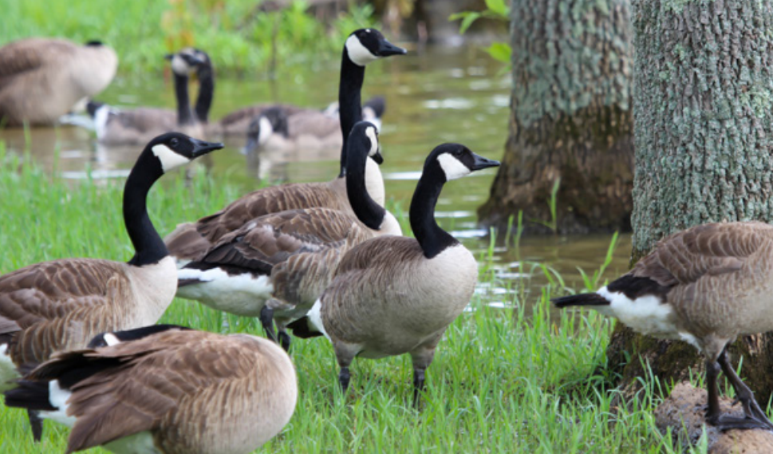

*Although seen as nuisances by some, conflicts with Canada geese are easily solved with humane deterrents.*

**Contents**

- [Relevant Natural History](#relevant-natural-history)
- [Geese Pooping in Yard](#geese-pooping-in-yard)
- [Concern About Goose Droppings on Playground or Other Public Area](#concern-about-goose-droppings-on-playground-or-other-public-area)
- [Aggressive Goose Chasing People](#aggressive-goose-chasing-people)
  - [During Nesting Season; Typically March - May](#during-nesting-season-typically-march---may)
  - [Not During Nesting Season; Typically June - February](#not-during-nesting-season-typically-june---february)
- [Canada Goose Nest on a Roof or Balcony](#canada-goose-nest-on-a-roof-or-balcony)
- [People Feeding Geese](#people-feeding-geese)
- [Geese (and Goslings) Crossing Road and Creating Traffic Hazard](#geese-and-goslings-crossing-road-and-creating-traffic-hazard)

# Relevant Natural History

After nearly being driven to extinction by over-hunting and habitat loss, Canada geese rebounded when wildlife managers bred captive flocks in the 1960s and released them throughout the country. The descendants of these captive-bred birds - who had clipped wings - never learned to migrate, giving rise to what we now call resident Canada geese: Those who stay in the lower 48 states year-round. The United States also provides home to migratory Canada geese, who migrate to Canada to nest in the spring. Migratory and resident Canada geese differ in behavior but not in biology; they are the same species of geese and are both protected by the [Migratory Bird Treaty Act](https://www.fws.gov/law/migratory-bird-treaty-act-1918).

Now, populations of resident Canada geese are increasing throughout most of the U.S. The impeccably mowed lawns found in our suburban landscape (parks, golf courses, cemeteries, lakeside communities, etc.) provide perfect habitat and nesting opportunities for these grass-grazing birds. Conflicts with resident Canada geese mainly occur in spring and summer when people take exception to all the droppings appearing in backyards and recreational areas.

# Geese Pooping in Yard

**ADVICE:** The caller can discourage geese from a yard using motion-activated sprinklers (like the Scarecrow), a squirt gun, a simple low fence or even Mylar balloons placed around the yard, tied to a weight and set three feet off the ground. Remind the caller that they may not harm the geese in any way, however, as geese are protected by the [Migratory Bird Treaty Act](https://www.fws.gov/law/migratory-bird-treaty-act-1918). 

# Concern About Goose Droppings on Playground or Other Public Area

**ADVICE:** The freshly mowed and fertilized lawns in soccer fields, parks, and golf courses are very attractive to Canada geese due to their succulent grasses and clear sightlines, which allow them to easily see any potential predators. The best way to lower goose numbers in these areas is to use a multi-faceted approach that includes habitat modification, aversive conditioning, humanely reducing the population through egg addling and reducing the feeding of geese by the public. Learn more at humanesociety.org/geese. 

# Aggressive Goose Chasing People

## During Nesting Season; Typically March - May

**ADVICE:** If a goose is acting aggressively and/or chasing people during the spring, it is likely that she is defending a nearby nest. It's common for Canada geese to nest outside entrances to shopping malls and other commercial buildings, with both the male and female protecting the nest by chasing away anyone who walks by. Tell the caller to avoid the area if possible. If they must walk by it, they can open and close an umbrella, pointed towards the goose, to act as a shield. 

**ACTIONABLE:** The best solution is to section off the area and redirect people away from that entrance, if possible. The goose will incubate the eggs in her nest for 28 days and then move on. If sectioning off the area is not possible, it may be necessary to remove the nest and eggs. To do this, the property owner will need to first register with the U.S. Fish and Wildlife Service. (See humanesociety.org/eggaddling for registration information and details about humane nest removal.) Geese will usually nest in the same location year after year, so take steps before nesting season the next year to prevent geese from using the same problematic nesting site. In February and March, place deterrents in the area, such as Mylar balloons attached to weights and placed three feet off the ground or a motion-activated sprinkler (such as the Scarecrow). 

## Not During Nesting Season; Typically June - February

**ADVICE:** If a goose is chasing or acting aggressively towards a person outside of nesting season, the goose most likely became accustomed to being fed by people and is demanding more. Advise the caller to scare the goose away by opening and closing an umbrella pointed in the goose's direction. 

**ACTIONABLE:** Use water guns or air horns as aversive conditioning to teach aggressive geese to stay away from people. Investigate sources of feeding and take steps to reduce these as much as possible.

# Canada Goose Nest on a Roof or Balcony

Canada geese will sometimes nest on a roof or balcony, seemingly not thinking ahead to how they will get their goslings safely down after they hatch. Goslings cannot fly until they are about 10 weeks old, and thus have no way to get down safely from a roof or balcony that is more than two stories above ground, the vertical distance the goslings can fall without injury.

**ADVICE:** Geese will usually nest in the same location year after year, so advise the caller to take steps before nesting season the next year to prevent geese from using the same problematic nesting site. In February and March, place deterrent devices in the area (such as Mylar balloons tied to weights and placed three feet off the ground or rooftop, or a motion-activated sprinkler such as the Scarecrow). These deterrents should prevent geese from nesting in the problematic area.

**ACTIONABLE:** If a goose has already laid and hatched eggs on a roof or balcony, dispatch an officer or contact a rehabilitator to help the goose and her goslings get down from the roof. A nest with eggs cannot be moved to a better site because the parent birds won't follow it. Unfortunately, in that case, the only option is to wait until the eggs hatch, then assist the goslings in getting off the roof. If possible, capture the male and female geese as well and release the geese and goslings next to a body of water.

# People Feeding Geese

**ADVICE:** Geese who are fed human food like bread can become malnourished and suffer a permanent deformity called Angel Wing, which renders them unable to fly. Eliminate feeding in the area by introducing fines or adding educational signage. Signs should explain that human food - especially bread - is unhealthy for geese and creates bad behaviors that result in tragic outcomes for the birds. Try diplomatically explaining these points to the goose feeders first, then instituting and enforcing a feeding ban if necessary and possible.

# Geese (and Goslings) Crossing Road and Creating Traffic Hazard

During the summer, it's common to see Canada geese and their goslings crossing the road on foot. This happens for two reasons. One, goslings can't fly until they are about 10 weeks old, so they must make the trek from their nesting site to a water source (which may be up to a mile away) on foot. Second, adult Canada geese undergo a six-week molt of their flight feathers in early summer, which means they're unable to fly until these feathers grow back in. During this time, it is common to see large groups of geese crossing roads in search of water and food.

**ADVICE:** Advise callers that they should not put themselves in harm's way to escort the geese and goslings across the road. If it is safe to do so, they can stop their vehicle and signal to other cars when the birds are crossing.