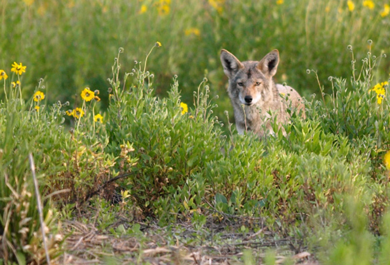

*Coyotes in urban and suburban settings tend to inspire fear, so you might need to calm nervous callers.*

Pasadena Humane's [Coyote Flyer](assets/pdf/WildlifeFlyers-Coyote.pdf).

**Contents**

- [Relevant Natural History](#relevant-natural-history)
- [Daytime Sighting of Coyote](#daytime-sighting-of-coyote)
- [Brazen Coyote](#brazen-coyote)
- [Keeping Coyotes Out of Yards](#keeping-coyotes-out-of-yards)
- [Fear of Family Being Attacked](#fear-of-family-being-attacked)
- [Concern About Coyote Vocalizations/Howling](#concern-about-coyote-vocalizationshowling)
- [Possibly Rabid Coyote](#possibly-rabid-coyote)
- [Coyote With Mange](#coyote-with-mange)
- [Attacks on Domestic Pets](#attacks-on-domestic-pets)
- [Coyotes and Chicken Coops](#coyotes-and-chicken-coops)
- [Coyote Pups Playing in the Yard](#coyote-pups-playing-in-the-yard)
- [Coyote Den on Property](#coyote-den-on-property)
- [Coyote Under a Deck, Porch or Shed](#coyote-under-a-deck-porch-or-shed)
- [Why Not Set a Trap?](#why-not-set-a-trap)

# Relevant Natural History

A member of the canid family, coyotes look similar to medium-sized dogs and are often confused with German shepherds. But they are actually smaller, weighing in at an average of 25-35 pounds. Contrary to popular myth, coyotes do not generally show aggression toward people or pets and are typically quite wary of humans. They seek out small easy prey like mice, chipmunks, shrews, rabbits and squirrels, providing people with free rodent control. However, they will take advantage of human-produced food - such as garbage or outdoor pet food - which can bring them closer to homes. Coyotes adapt easily to the presence of people in their landscape, yet people's exaggerated fears, often based on perceptions about coyotes being akin to the "big bad wolf," result in unnecessary panic and calls for coyotes to be removed.

# Daytime Sighting of Coyote

 **ADVICE:** It is perfectly natural behavior for a coyote to be outside during the day, especially during the spring and summer when they are busy hunting rodents to feed their young. Just seeing a coyote during the day doesn't mean the animal is rabid, aggressive or dangerous.

# Brazen Coyote

**ADVICE:** Coyotes may lose their natural fear of people when they find free sources of human-associated food (e.g., pet food left outside) and have repeated contact with people with no negative consequences. You can teach an overly bold coyote to be wary of people with negative conditioning or "hazing." To do that, be big and scary: Raise your arms over your head, yell or blow a whistle and bang metal pot tops together as you move toward the animal or spray the animal's hindquarters with a hose or water gun. Hazing works best if you keep the negative reinforcement going until you deter the animal from the property.

# Keeping Coyotes Out of Yards

**ADVICE:** You can prevent coyotes from visiting your yard by taking a few precautions:
- Do not leave pets outside unattended.
- Do not leave pet food outside.
- Keep garbage in a secure container and only put it outside on the morning of pickup.
- Do not put any meat scraps in compost heaps.
- Pick up fallen fruit from underneath trees.
- Cut back brush around your property that might provide cover
for coyotes or their prey.

Coyotes can easily get over fences six feet tall or shorter. For fences at least six feet tall, the Coyote Roller (available from Roll Guard, 619-977-6031 or coyoteroller.com) is an effective device to keep dogs in and coyotes out. This free-standing cylinder attaches to the top of a fence and literally "rolls" off any animal who is attempting to climb over.

# Fear of Family Being Attacked

**ADVICE:** Coyote attacks on people are extremely rare. Most, if not all, of the few cases of coyotes biting humans that occur nationally each year are directly related to coyotes being fed by humans, whether intentionally or not. Take proactive measures to ensure the property contains no food—such as garbage or pet food—that will entice animals and use hazing techniques to scare away any overly bold coyotes.

**ACTIONABLE:** If the caller, a family member or pet is actually bitten by a coyote, tell them to contact their local animal control officer immediately. Tell the caller to wash the wound with soap and water (wear gloves if handling a potentially bitten pet) and to contact the local health department and their own doctor (or veterinarian) for guidance. Gather as much information about circumstance and context (such as whether feeding or pets were involved, etc.).

# Concern About Coyote Vocalizations/Howling

**ADVICE:** Coyotes are quite vocal animals, capable of producing more than a dozen different sounds including howls, yips and barks. A group of just a few coyotes can sound like 10 or 20 coyotes. A common misconception is that coyotes howl after celebrating a kill (which the public often assumes to be a dog or cat). Assure the caller that coyotes do not hunt in packs (they don't need to; their diet mostly consists of small rodents), nor do they vocalize after hunting. Their vocalizations are simply greetings between family members or coyotes defending their territory from other groups. 

# Possibly Rabid Coyote

**ADVICE:** A daytime sighting alone does not indicate rabies. Coyotes are normally active by day and rabies is rare in these animals.

**ACTIONABLE:** Dispatch an officer if the coyote is acting sick or showing abnormal behaviors that might indicate rabies, such as partial paralysis, circling, staggering as if drunk or disoriented or self-mutilating, or if the animal exhibits unprovoked aggression or unnatural tameness. Tell callers to keep their family and pets inside while waiting for help. 

# Coyote With Mange

Coyotes who scratch a lot, who seem disoriented or weak and who have missing fur (or are completely bald) are afflicted with mange, which is an ailment caused by tiny mites under the skin. Coyotes with mange may be seen "languishing in yards" or taking advantage of pet food left outside because they are too weak to hunt. Because mites can live up to 24 hours without a host, it's important that the caller keep pets away from the area if possible. 

**REFERRAL:** Refer to a wildlife rehabilitator.

**ACTIONABLE:** Dispatch an ACO if the coyote is acting sick or approaching people.

# Attacks on Domestic Pets

**ADVICE:** It is normal behavior for coyotes to prey on outdoor cats, which is why it is so important for people to keep cats indoors. Small dogs left outside unattended are also at risk of coyote attacks, especially in the spring and summer when coyotes are hunting to feed their pups. To protect pets, instruct people never to let their pets - regardless of size - outside unattended and to keep pet food inside. It's also important, especially during the winter months when it's coyote breeding season, to keep large dogs on a leash; coyotes may view large off-leash dogs as a threat to their mates. 

# Coyotes and Chicken Coops

**ADVICE:** The only effective way to protect your chickens is to reinforce the coop so coyotes and other animals can't get in. Because chickens, eggs and supplemental feed like corn (which attracts rodents) will continually draw in wildlife, it's important to boost your coop's security and use harassment techniques to deter wild animals who are tempted to break in. A secure coop must have perimeter fencing that is buried down into the ground or run 18-plus inches outward and horizontally to the ground. (This is called an L-shaped footer; visit humanesociety.org/digginganimals for more information). You must also reinforce the walls and door of the structure. Chicken wire alone is not wildlife-proof. Heavy, 16-gauge welded wire mesh with 1-inch by 1-inch openings is a good choice. Although reinforcing a pen may be a temporary inconvenience, once an animal pen is wildlife-proofed, the problem is solved for the long term.

# Coyote Pups Playing in the Yard

**ADVICE:** In the spring, it is normal to see coyote pups romping and tumbling in the yard, playing like puppies. The play activity helps the pups prepare to go out on hunting trips with their parents. They will be accompanying pups soon, and their use of the den and yard will only last a short while longer. As cute as the pups are, callers should be advised not to feed them or initiate contact so they don't lose their fear of humans. Instead, they should be left alone. If they get too close, callers can clap their hands and yell to scare the pups and teach them to associate humans with a negative stimulus. Orphaned pups are very rare, as both parents aid in the rearing of their young (unlike most other mammals, who are raised by the mother only).

# Coyote Den on Property

**ADVICE:** People are often surprised to discover a coyote den near their property. This is no cause for alarm. It can be a lot of fun (and a great photo opportunity!) to watch a coyote family grow up. If the animals absolutely must be evicted, humane harassment strategies can encourage them to leave. 

- Place dirty, sweaty socks or rags sprinkled with cider vinegar inside the den entrance, along with a blaring radio. This should make the coyotes uncomfortable and motivate them to move on. However, they may be resistant - it's a lot of work to find and excavate a new den. 
- Sprinkle a capsaicin-based repellent (such as Critter Ridder) or used kitty litter around the den hole and then mix it with the dirt before loosely filling the hole. Capsaicin-based repellents irritate the eyes, nose and mouth of most animals (including humans) and can be an effective deterrent. 
- Never use moth balls or ammonia to harass wildlife. The chemicals released are harmful to both humans and animals.

**BETTER OPTION:** After learning that their fears were unfounded, many people find that letting the coyote family stay is the easiest option and a memorable treat! Encourage callers to just enjoy them, but to practice safe behaviors around them, such as not getting too close and not leaving food outdoors.

# Coyote Under a Deck, Porch or Shed

**ADVICE:** Coyotes may occasionally make their dens under man-made structures like porches, decks and sheds. Letting the coyote family stay throughout the baby-rearing season is the easiest and most humane answer to this "problem." If tolerance is not an option, the harassment techniques described above can be effective. 

After pup-rearing season, the caller can permanently prevent coyotes and other wildlife from using the space under the structure by installing an L-shaped footer. When installing the barrier, make sure no animals are present. If the caller can't verify whether an animal is there, they can install a one-way door that gives any animals inside a way out. Or they can test the opening by blocking the entrance with material that the coyote can push aside, which will let them know a coyote is still present. Learn more at humanesociety.org/digginganimals.

# Why Not Set a Trap?

**ADVICE:** Trapping hardly ever solves wildlife problems. Even in studies where all the coyotes were trapped out of an area, others from the surrounding area quickly moved into the vacated niche. In addition, trapping often leads to starving young being left behind. It's much more effective to exclude wild animals from areas where they're not wanted rather than to continually remove all animals who may be attracted to a good food source or den/nest site (refer to [Why not trap and relocate](WCG-Why-not-trap-and-relocate) to help the caller understand the problems with trapping).