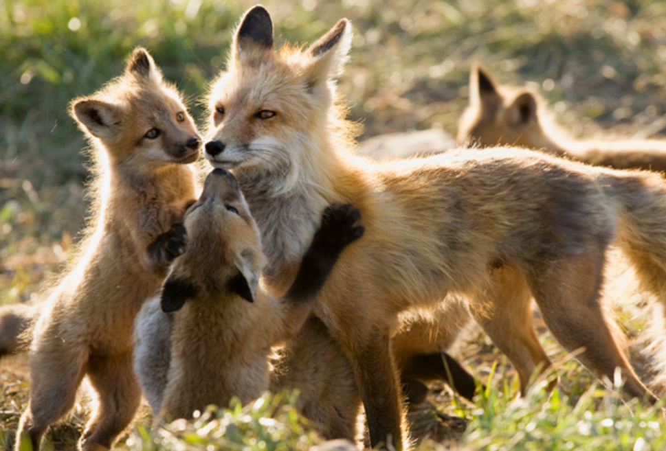

*Surprised at seeing a fox in the neighborhood, many callers will require reassurance that pets and children aren't in danger.*

**Contents**

- [Relevant Natural History](#relevant-natural-history)
- [Daytime Sighting of a Fox](#daytime-sighting-of-a-fox)
- [Brazen Fox](#brazen-fox)
- [Possibly Rabid Fox](#possibly-rabid-fox)
- [Fox with Mange](#fox-with-mange)
- [Attacks on Domestic Pets](#attacks-on-domestic-pets)
- [Fear of Family Being Attacked](#fear-of-family-being-attacked)
- [Foxes and Chicken Coops](#foxes-and-chicken-coops)
- [Fox Kits Playing in the Yard](#fox-kits-playing-in-the-yard)
- [Fox Den on Property](#fox-den-on-property)
- [Fox Under a Deck, Porch or Shed](#fox-under-a-deck-porch-or-shed)
- [Fox "Screams"](#fox-screams)
- [Why Not Set a Trap?](#why-not-set-a-trap)

# Relevant Natural History

Like coyotes, foxes are a member of the canid family. There are five species of foxes in North America, but only two - the red and the gray - are found in urban settings. The most accurate way to tell a red fox from a gray fox is by looking at the tail: red foxes have a white tip at the end of their tail, while gray foxes have a black tip. 

People sometimes worry that foxes are going to prey on them or their children, not realizing that foxes prefer to seek out small easy prey, such as mice, chipmunks, shrews, rabbits, frogs, snakes, and squirrels. In fact, foxes actually provide people with free rodent control. They may also take advantage of human-produced food, such as garbage or pet food left outside. Much to many people's surprise, foxes are not much bigger than a domestic housecat, weighing in at an average of 8-12 pounds. They are adaptable opportunists who don't mind living close to people in suburban and urban settings, and their presence often goes unnoticed. However, people may be surprised to see a fox in their backyard and that surprise often leads to unnecessary panic.

# Daytime Sighting of a Fox

**ADVICE:** It is perfectly natural behavior for a fox to be outside during the day, especially during the spring and summer when they are busy hunting rodents to feed their young. Simply because a fox is active during the day doesn't mean the animal is rabid. 

# Brazen Fox 

**ADVICE:** Foxes may lose their natural fear of people when they find free sources of human-associated food (e.g., pet food left on porches) in neighborhoods and have repeated contact with people with no negative consequences. You can teach an overly bold fox to be wary of people by using negative conditioning or "hazing." To do that, be big and scary: Raise your arms over your head, yell or blow a whistle and bang metal pot tops together as you move toward the animal or spray the animal's hindquarters with a hose or water gun. Hazing works best if you keep the negative reinforcement going until you deter the fox from the property. 

# Possibly Rabid Fox

**ADVICE:** A daytime sighting alone does not indicate rabies. Foxes are normally active by day. Like any mammal, foxes can contract rabies, but it is not common.

**ACTIONABLE:** Dispatch an officer if the fox is acting sick or showing abnormal behaviors that might indicate rabies, such as partial paralysis, circling, staggering as if drunk or disoriented or self-mutilating, or if the fox exhibits unprovoked aggression or unnatural tameness. Advise callers to keep their family and pets inside while waiting for help. 

# Fox with Mange

Foxes who scratch a lot, seem disoriented or weak and who have missing fur patches (or are completely bald) are afflicted with mange, which is an ailment caused by tiny mites under the skin. Foxes with mange may be seen "languishing in yards" because they are too weak to hunt. Because mites can live up to 24 hours without a host, it's important that the caller keep pets away from the area if possible.

**REFERRAL:** Refer to a wildlife rehabilitator.

**ACTIONABLE:** Dispatch an ACO if the fox is acting sick or approaching people.

# Attacks on Domestic Pets

**ADVICE:** People often worry that their cat or dog will be attacked by a fox. They don't realize that foxes focus on small easy prey that won't hurt them, like rodents, and only weigh on average 8-12 pounds and are about the size of an adult cat. Smaller pets (such as kittens, rabbits, chickens, or guinea pigs) left outside could be at risk, though, and should either be kept indoors or in secure enclosures outside.

# Fear of Family Being Attacked 

**ADVICE:** Fox attacks on people are extremely rare and that is why they are highly publicized the few times they do happen. Neither the Centers for Disease Control and Prevention nor any other health authority has classified foxes as a human safety risk. Instruct the caller to take proactive measures to ensure the property contains no food - such as garbage or pet food - that will entice animals and to use hazing techniques to scare away any overly bold foxes.

**ACTIONABLE:** If the caller, a family member, or pet is actually bitten by a fox, they should wash the wound with soap and water (wear gloves if handling a potentially bitten pet) and contact the local health department and their own doctor (or veterinarian) for guidance. Gather as much information about the incident as possible (such as whether the person was intentionally feeding the fox, etc.).

# Foxes and Chicken Coops

**ADVICE:** The only effective way to protect chickens is to reinforce the coop so foxes and other animals can't get in. Because chickens, eggs, and supplemental feed like corn (which attracts rodents) will continually draw in wildlife, it is important that the caller boost their coop's security and use harassment techniques to deter wild animals who are tempted to break in. A secure coop must have perimeter fencing that is buried down into the ground or run 18-plus inches outward and horizontally to the ground. (This is called an L-shaped footer; visit humanesociety.org/digginganimals for more information.) You must also reinforce the walls and door of the structure. Chicken wire alone is not wildlife-proof. Heavy, 16-gauge welded wire with 1-inch by 1-inch openings is a good choice. Although reinforcing a pen may be a temporary inconvenience, once an animal pen is wildlife-proofed, the problem is solved for the long term.

# Fox Kits Playing in the Yard

**ADVICE:** In the spring and summer it is normal to see fox kits romping and tumbling in the yard, playing like puppies. The play activity they are exhibiting is all in preparation to go out on hunting trips with their parents, but they are not quite ready yet. It may be a matter of several weeks. As cute as the kits are, it is important that callers are advised not to feed them or initiate contact so they don't lose their fear of humans. Instead, they should be left alone. If they get too close, callers can clap their hands and yell to scare the kits and teach them to associate humans with a negative stimulus. Since both parents rear their young - with the occasional help of other related adults - it's pretty uncommon for both parents to have died or have been killed.

# Fox Den on Property

**ADVICE:** People are often surprised to discover a fox den near their property. This is no cause for alarm. Foxes only use the den for a short time, and it can be a lot of fun (and a great photo opportunity) to watch a fox family grow up. If the animals absolutely must be evicted, humane harassment strategies can encourage them to leave. However, be aware that if you use these techniques during baby season, the young may be unable to move away from the irritants on their own.

- Place dirty, sweaty socks or rags sprinkled with cider vinegar inside the den entrance, along with a blaring radio. This should make the foxes uncomfortable and motivate them to move on. However, they may be resistant - it can be a lot of work to find a new den.
- Sprinkle a capsaicin-based repellent (such as Critter Ridder) or used kitty litter around the hole under the fence and mix it with the dirt before loosely filling the hole. Capsaicin-based repellents irritate the eyes, nose, and mouth of most animals (including humans) and can be a highly effective repellent. The caller can also attach Mylar balloons to weights and place them 3 feet off the ground around the den opening. Shiny balloons bobbing in the wind can enhance the harassment effect.
- Never use moth balls or ammonia to harass wildlife. The chemicals released are harmful to both humans and animals.

**BETTER OPTION:** After learning that their fears were unfounded, many people find that letting the fox family stay is the easiest option, and one which becomes a memorable treat. Encourage callers to just enjoy them and take lots of photos, while reminding them to keep a distance and avoid leaving food outside.

# Fox Under a Deck, Porch or Shed

**ADVICE:** Foxes occasionally make their dens under man-made structures like porches, decks, and sheds. It's important to let the caller know that the foxes will eventually leave on their own, so letting the fox family stay until the young are ready to go is the easiest and most humane option. If the caller insists they go, harassment techniques like those mentioned above can be effective. After baby season - and only if necessary - the caller should consider permanently preventing foxes and other wildlife from using the space in the future by installing an L-shaped footer. When installing the barrier, make sure no animals are present. If the caller can't verify whether an animal is there, they can install a one-way door that gives any animals inside a way out. Or they can test the opening by blocking the entrance with material that the fox can push aside, which will let them know a fox is still present. Learn more at humanesociety.org/digginganimals.

# Fox "Screams"

**ADVICE:** During breeding season, foxes will make eerie, loud vocalizations which people may misinterpret as human screams or even paranormal activity! There is nothing that can be done about this other than waiting it out and realizing that this is all part of a fox's natural breeding behavior and that it will end soon.

# Why Not Set a Trap?

**ADVICE:** Trapping hardly ever solves wildlife problems. Even in studies where all the coyotes were trapped out of an area, others from the surrounding area quickly moved into the vacated niche. In addition, trapping often leads to starving young being left behind. It's much more effective to exclude wild animals from areas where they're not wanted rather than to continually remove all animals who may be attracted to a good food source or den/nest site (refer to [Why not trap and relocate](WCG-Why-not-trap-and-relocate) to help the caller understand the problems with trapping).