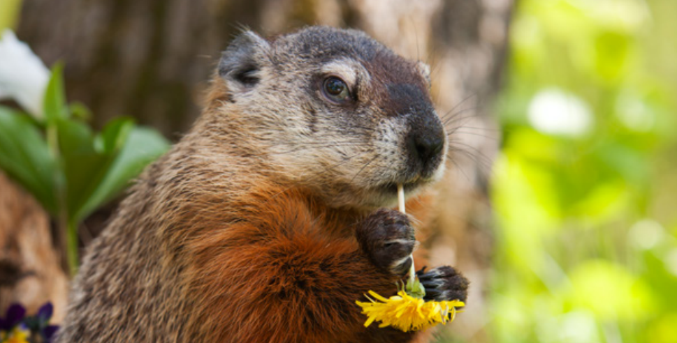

*Callers who want to prevent groundhogs from nibbling their gardens should use humane exclusion methods rather than trapping and removing the critters.*

**Contents**

- [Relevant Natural History](#relevant-natural-history)
- [Woodchuck Seen in Daytime](#woodchuck-seen-in-daytime)
- [Fear of Woodchucks Harming Children](#fear-of-woodchucks-harming-children)
- [Woodchuck Acting Aggressive, Chasing People](#woodchuck-acting-aggressive-chasing-people)
- [Woodchuck Circling and Falling Over](#woodchuck-circling-and-falling-over)
- [Woodchuck Under Shed/Deck](#woodchuck-under-sheddeck)
- [Woodchuck Eating Garden](#woodchuck-eating-garden)
- [Woodchucks Burrowing Under a Fence to Access Yard](#woodchucks-burrowing-under-a-fence-to-access-yard)
- [How to Release a Woodchuck From a Trap](#how-to-release-a-woodchuck-from-a-trap)
- [Why Not Set a Trap?](#why-not-set-a-trap)

# Relevant Natural History

Groundhogs are shy, timid creatures - despite their burly looks. Also called woodchucks, gophers, and even whistle-pigs, they pop up in yards after a long winter hibernation. Their burrows usually have several entry and exit points which they scurry into when alarmed. Suburbia provides the perfect habitat: Our raised decks, stoops, and sheds provide cover and a welcoming site to raise young, and our lush lawns and gardens provide a virtual buffet. Most woodchuck conflicts occur in summer, when the war is on for who gets to eat the garden vegetables. Summer is also just when baby-rearing season occurs, which is why orphaned young will be left behind unless problems are resolved correctly and humanely.

# Woodchuck Seen in Daytime

**ADVICE:** This is normal; woodchucks are usually active in the daytime. This does not indicate rabies. 

# Fear of Woodchucks Harming Children

**ADVICE:** Woodchucks are timid creatures who scamper off when scared. Remember that even a small child looks like a giant predator to the woodchuck. There is no cause for alarm - healthy woodchucks aren't interested in children or pets; their diet is 100% vegetarian. If chased, woodchucks will quickly flee to their burrows.

# Woodchuck Acting Aggressive, Chasing People

**ACTIONABLE:** Dispatch an ACO and instruct the caller to keep people and pets inside. 

# Woodchuck Circling and Falling Over

**ADVICE:** The woodchuck may be rabid, but she's more likely to be suffering from a brain parasite called roundworm. This parasite causes symptoms that look exactly like those caused by rabies. Either way, if someone reports these symptoms, dispatch an officer to assess and handle the situation. Instruct the caller to keep children and pets away from the animal while waiting for an officer to arrive.

# Woodchuck Under Shed/Deck

**ADVICE:** Many people decide to let woodchucks stay because their burrows don't tend to undermine foundations or damage sheds/decks. In spring and summer, it's most likely a mother nursing her young. After the young are old enough to leave the den, the caller can try to evict the family by putting some Critter Ridder granules (a capsaicin-based repellent available at most garden stores), urine-soaked kitty litter or sweaty, smelly gym shirts or socks into the woodchuck burrow. Once the animals are gone, protect decks or sheds using an L-shaped design (see humanesociety.org/groundhogs), but make sure there are no animals trapped inside or babies left behind to starve.

# Woodchuck Eating Garden

**ADVICE:** The caller can exclude woodchucks from the garden by putting up a simple mesh fence (visit humanesociety.org/groundhogs for details). They'll need a roll of 4-foot-high green garden mesh or chicken wire and stakes. Once the job is done, it won't matter how many woodchucks are in the neighborhood; they won't be getting into the caller's garden! There are two secrets for making a successful fence:

- Tip #1: The top part of the fence only needs to be 3 feet high, but it should be staked so that it's wobbly (i.e., the mesh should not be pulled tight between the stakes). Instead, the mesh should have some "give" so when the woodchuck tries to climb the fence, it wobbles and discourages him from climbing higher. After climbing over the fence fails, he'll try to dig under it, so...
- Tip #2: Extend the bottom portion 12 inches outward, away from the garden, in an L shape that creates a false bottom. (Put this mesh "flap" on top of the ground, but be sure to secure it firmly with landscaping staples; otherwise the woodchuck will go under it.) When the woodchuck digs down and hits this mesh flap, he'll think he can't dig any farther and give up. It won't occur to him to stand back a foot and THEN start digging!

If the caller won't put up a fence, you can advise them to try the following scare techniques, which do work in some cases:

- Line the garden with helium-filled Mylar or "Scare-Eye" balloons (found on Amazon, the Bird-X website, most big box stores). Attach them to weights and place them about 3 feet off the ground. The bobbing balloons will scare the woodchucks.
- Put Critter Ridder (a capsaicin-based repellent) or blood meal fertilizer around the garden's perimeter, sprinkle cayenne pepper around plants or spray a taste repellent such as Ropel on the plants every two weeks.

# Woodchucks Burrowing Under a Fence to Access Yard

**ADVICE:** When a woodchuck makes an appearance through a hole under a fence, it's likely that the caller has some tasty fruits or vegetables in their yard! If the caller is unwilling to tolerate occasional visits, they can close the hole and prevent new openings, but only after first confirming that the hole is a direct pass-through to the other side and not the entry to an underground burrow. They should also confirm that the woodchuck is not still in their yard before they close the hole. 

The caller can loosely fill the hole with dirt mixed with either urine-soaked kitty litter or a capsaicin-based repellent (such as Critter Ridder) to deter the woodchuck from trying to get through the hole again. Then, using a strip of wire screening or garden fencing material approximately 20 inches wide and the length of the affected fence, unroll the screening along the fence line. Secure the screening (along both the interior and exterior edges) tightly to the ground using landscaping staples (available at home improvement and/or gardening stores). If the woodchuck burrows under the fence from the neighbor's side, he will be surprised to find the screening blocking his exit on your side. The screening can be left uncovered or covered with dirt.

# How to Release a Woodchuck From a Trap

Animals in traps are highly stressed and should be released on site immediately. Explain that trapping in spring and summer leaves babies behind to starve, and trapping doesn't address the root cause of the problem. The caller can safely release the woodchuck by putting a towel over the trap (creating a visual barrier to calm both the woodchuck and the caller), pointing the trap away from traffic and opening the door (while wearing gloves) or propping it open with a book. They shouldn't shake the trap. The woodchuck will come out on her own. If they refuse to let the woodchuck out, it's vital for animal control or a volunteer to assist so the animal is not left in the trap to suffer and die.

# Why Not Set a Trap?

**ADVICE:** Trapping hardly ever solves wildlife problems. Even in studies where all the coyotes were trapped out of an area, others from the surrounding area quickly moved into the vacated niche. In addition, trapping often leads to starving young being left behind. It's much more effective to exclude wild animals from areas where they're not wanted rather than to continually remove all animals who may be attracted to a good food source or den/nest site (refer to [Why not trap and relocate](WCG-Why-not-trap-and-relocate) to help the caller understand the problems with trapping).