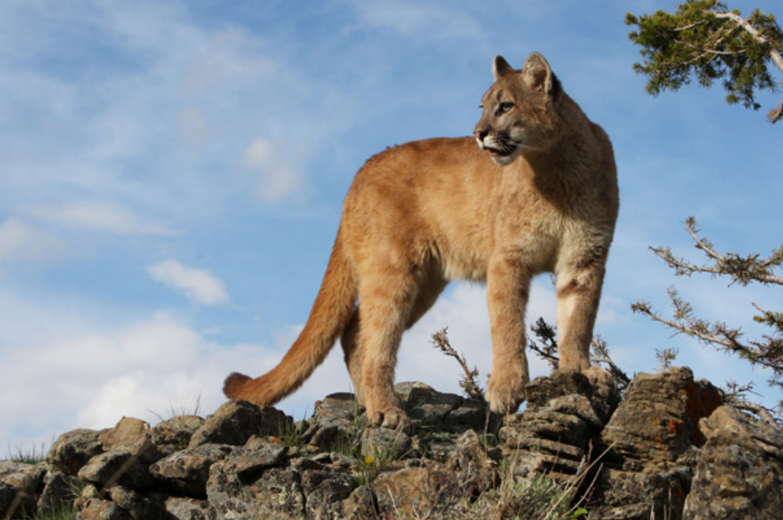
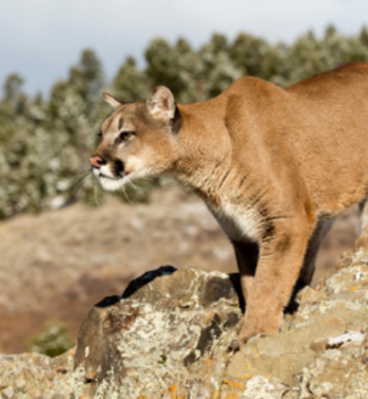

*Taking simple precautions in cougar country can easily prevent conflicts.*

**Contents**

- [Relevant Natural History](#relevant-natural-history)
- [Encountering a Mountain Lion in an Urban/Suburban Area](#encountering-a-mountain-lion-in-an-urbansuburban-area)
- [Depredation of Livestock by Mountain Lions](#depredation-of-livestock-by-mountain-lions)
- [Attacks on Domestic Pets](#attacks-on-domestic-pets)
- [Attack on Person by Mountain Lion](#attack-on-person-by-mountain-lion)

# Relevant Natural History

Mountain lions (also called pumas, cougars, panthers, and catamounts) can be found in 15 western states, with an additional endangered population in southern Florida. Ranging in size from 80 to 180 pounds, mountain lions are known for their remarkable physical abilities: They're capable of reaching sprinting speeds of 50 mph and leaping up to 40 feet. The preferred prey for mountain lions is deer or other large herbivores, although they are opportunistic carnivores and will eat rabbits, squirrels, raccoons, skunks, and other small mammals. They often drag prey to a hiding spot and feed on it for multiple days.

Mountain lions are not common suburban or urban inhabitants, but as towns, cities, and recreational areas expand into natural areas, encounters become more common. Mountain lions will occasionally follow the trails of their prey into more inhabited areas. Young males - and occasionally females - will enter human communities on their way to find a mate or new territory. These dispersing young typically move through these areas without harm and avoid encounters with humans whenever possible. Drought and/or access to food, water, and shelter may also draw mountain lions into populated areas. Still, mountain lions tend to be shy and nocturnal, and encounters with them are rare.

# Encountering a Mountain Lion in an Urban/Suburban Area

**ADVICE:** Occasionally a mountain lion will follow a natural corridor such as a waterway or open space into more populated areas. Generally, they will not remain in the area for long. If the caller spots a mountain lion, instruct the caller to move pets and children indoors and avoid approaching the animal. If the caller is not near shelter, instruct them to pick up small pets and children and face the cougar. They should make themselves look larger by raising their arms or opening their jacket over their head and talking or singing in a calm but loud voice. Instruct them not to approach the animal and especially not to run, as it may trigger the cat to chase. They can also blow a whistle or air horn at the mountain lion if they have one, open and close an umbrella, or throw rocks in the direction of the mountain lion to scare him away. 

If the mountain lion has entered the caller's yard, encourage the caller to remove any potential food attractants after the mountain lion has left. Ensure that trash is stored in well-secured containers, remove any pet food left outside, remove any meat from compost piles, and stop feeding deer or other wildlife that may attract mountain lions.

**ACTIONABLE:** If a mountain lion is in a residential area (and especially if the mountain lion is approaching people), contact the state wildlife agency as necessary and dispatch an ACO to haze the mountain lion. Afterwards, conduct a yard and/or neighborhood audit to remove potential food attractants that may have attracted the mountain lion. 

# Depredation of Livestock by Mountain Lions

**ADVICE:** The best way to prevent future depredation of livestock by mountain lions is to provide adequate housing and protection for livestock. Chickens and other small animals must be kept in secure enclosures that are covered on all sides, including the top. Larger livestock are best protected by guard animals such as donkeys, llamas, and specially trained dogs. Where possible, place livestock in enclosed sheds or barns at night. The use of flashing lights, sirens, and electric fences can also help deter wildlife from approaching livestock.

# Attacks on Domestic Pets

**ADVICE:** Mountain lions do not commonly attack domestic pets, but free-roaming and unattended pets face risks from a variety of wildlife. The best protection for cats and other small pets (such as rabbits or guinea pigs) is to keep them exclusively indoors or to provide a secure enclosure for them outside that is covered on top and includes a floor to deter digging and/or jumping in or out. Dogs should be walked on leashes 6 feet or shorter and supervised when outside. It's important for the caller to understand that mountain lions are good climbers who can jump 12 feet or more vertically, so most fences will not protect unsupervised pets outside. The caller may also want to consider minimizing brush and cover in their yard; these materials can provide a hiding place for cougars. Flashing lights, sirens, motion-detecting sprinklers, and electric fences may also deter mountain lions from approaching.

# Attack on Person by Mountain Lion

**ADVICE:** Attacks on people by mountain lions are very rare. Callers who are simply afraid of mountain lion attacks should be instructed to take the following precautions while hiking in mountain lion country:

- Take a friend along on the hike
- Be aware of surroundings, don't wear headphones
- Bring along a whistle or air horn to make noise if an animal is encountered
- Keep children under the age of 16 close by
- Keep dogs on a leash 6 feet long or shorter

Additionally, recreating in lion country during daylight hours will reduce the chance of encountering a cat. Callers should be advised to not recreate from dusk to dawn, which are peak lion activity hours.

**ACTIONABLE:** In the rare event of a mountain lion attack on a person, the victim should yell and fight back by punching the mountain lion or hitting him with objects. It's important that they use what they have. People have stopped attacks by hitting the animal with sticks, their hands, garden tools, and even baseball caps. Dispatch an ACO and notify the state wildlife agency for the appropriate protocols. Ensure that the victim receives immediate medical attention.