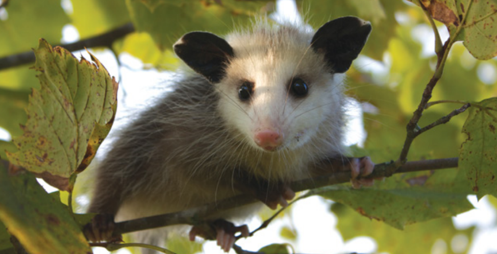

*You can help defend the much-maligned opossum by informing callers about the important insect-eating services these animals provide.*

**Contents**

- [Relevant Natural History](#relevant-natural-history)
- [Opossum Seen on Lawn or in Tree](#opossum-seen-on-lawn-or-in-tree)
- [Concern About Potentially "Rabid" Opossum](#concern-about-potentially-rabid-opossum)
- [Baby Opossum Alone](#baby-opossum-alone)
- [Opossum in Trash Can](#opossum-in-trash-can)
- [Opossums Eating Garbage](#opossums-eating-garbage)
- [Opossum in Garage](#opossum-in-garage)
- [Opossum Stuck in Fence or in Tree](#opossum-stuck-in-fence-or-in-tree)
- [Opossum Under Deck/Shed](#opossum-under-deckshed)
- [Opossum in Window Well](#opossum-in-window-well)
- [Opossum in Trap](#opossum-in-trap)
- [Dead Opossum](#dead-opossum)
- [Why Not Set a Trap?](#why-not-set-a-trap)

# Relevant Natural History

Opossums are shy, non-aggressive creatures who have the misfortune of scaring people due to their rather odd appearance. They aren't fierce at all, and they actually have little ability to defend themselves. They don't run fast or fight well, so their best defense is to try scaring off potential attackers. Their swaying, drooling and hissing routine is a bluff - and if that bizarre behavior doesn't work to scare you, they fall over and play dead. Unfortunately, this bluff routine is often wrongly perceived as the symptoms of rabies. Opossums are very beneficial animals; they provide free pest control by eating things some people don't like, such as bugs, small snakes, mice and even baby rats.

# Opossum Seen on Lawn or in Tree

**ADVICE:** This is normal behavior, not cause for alarm. Opossums are typically active at dawn and dusk but can be seen at any time. They are not looking to attack or bother anyone; they are actually very gentle and harmless creatures (despite their scary looks!).

# Concern About Potentially "Rabid" Opossum

**ADVICE:** Surprisingly, opossums rarely - if ever - get rabies. If the opossum is hissing, drooling, swaying and/or opening her mouth really wide (so you can see all 50 teeth), he's just doing a bluff routine to scare you or a dog off. What you're seeing is normal defensive behavior. Tell the caller to move away or bring in their dog for a little while, and the opossum will leave once she realizes that the threat is gone.

# Baby Opossum Alone

**ADVICE:** Baby opossums stay in their mother's pouch until they are about 2.5 months old and the size of a mouse. At this age, they ride on Mom's back and can sometimes fall off without her noticing. 

**REFERRAL:** If the baby opossum is shorter than 7 inches long (smaller than a dollar bill, not including the tail), she is too young to be on her own. Refer the caller to a wildlife rehabilitator. If the baby's body length is longer than 7 inches (bigger than a dollar bill, not including the tail), then she's big enough to survive on her own.

# Opossum in Trash Can

**ADVICE:** Opossums are attracted by the smell of food but get stuck inside and can't climb out. Slowly tip the can on its side and the opossum will come out when he's ready. (They don't move when scared, so it may take a while.) If the caller is uncomfortable doing this, they can also use a broom to gently tip the trash can over. Remind them to get a secure lid for the trashcan (or use bungee cords or get the Animal Stopper brand trash can) so the problem doesn't recur.

# Opossums Eating Garbage

**ADVICE:** Like most wildlife, opossums will take advantage of open or spilled garbage containers, so the solution is better containment. People can secure trash lids with bungee cords, get an Animal Stopper brand trash can (which has built-in bungee cords), put the garbage out the morning of trash pickup or get an outdoor storage enclosure for trash cans from a home-building store. Trapping won't solve the problem; as long as there's a food source, the animal will return to it.

# Opossum in Garage

**ADVICE:** Opossums may wander into garages if the door is left open. Remove access to food, birdseed bags or trash. Then open the garage door before dusk, sprinkle an 8-inch band of white flour under it and watch for exiting footprints. Shut the door once the animal leaves.

# Opossum Stuck in Fence or in Tree

**ADVICE:** Make sure the opossum is really stuck! If a dog has run him up a tree or onto a fence, he won't move until the threat is long gone. If the opossum is truly stuck in a fence, dispatch an officer for help.

# Opossum Under Deck/Shed

**ADVICE:** No need to do anything. Opossums are nomadic and will leave on their own very soon. They are gentle and non-aggressive animals who will not attack anyone. If the caller won't tolerate them, the caller can seal off the deck or shed using an L-shape barrier design, but it is critical not to entrap animals or separate parents from babies who will starve without them (note that there may be other wildlife using the deck or shed). We recommend sealing off the deck with mesh while leaving one exit hole and putting a one-way door (or animal excluder, available from Tomahawk Live Trap Co.) over that hole so the opossum can leave but not return. Leave the door in place for at least three days. 

NOTE: Tell the caller never to use mothballs or ammonia to harass wildlife. The chemicals are harmful to both humans and animals.

# Opossum in Window Well

**ADVICE:** Put a 3-inch-thick branch or two-by-four board in the window well so the opossum can climb out. Rest assured - he won't jump up and attack! Be sure to get a window well cover (inexpensive from home-building stores) after the opossum is gone or this problem may happen again.

# Opossum in Trap

**ADVICE:** Most people don't realize that opossums are nomadic and really don't pose problems, so there's rarely any reason to trap them. They're often caught in traps set for other animals. The most important task for a caller is to get the opossum out of the trap quickly. Ask the caller to first cover one end of the trap; this creates a visual barrier and reduces the caller's and the animal's stress. Then instruct them to open the trap door and prop it open with a rock or a book so the opossum can leave on his own after he has recovered from his own fear response. When opossums are scared, they hiss and open their mouth wide in fear, but they hold their ground. Tell the caller to stay a good distance from the trap, and the opossum will leave once the coast is clear. Remind the caller that the opossum won't come out and attack; he's too scared!

# Dead Opossum

**ADVICE:** If a clearly dead opossum is found in the road in late spring or summer, and it is safe for the caller to do so, have the caller check whether there are any surviving babies in her pouch that need to be detached. Because the babies are born as embryos, as many as 13 may be in the mother's pouch nursing. They can be difficult to detach from her teats but can be gently "unscrewed." The babies should immediately be taken to a wildlife rehabilitator. 

Another possibility is that the opossum is just playing dead, which is a defense mechanism they use to protect themselves from predators. When an opossum is playing dead, no amount of disturbance (loud noise included) will get her to move until she's ready! If the caller is not sure whether an opossum is dead or playing dead, ask them to leave the area for an hour and check back to see if she's gone. If they're unsure whether her pouch contains babies, they can gently nudge her with a stick and see if there's any movement.

# Why Not Set a Trap?

**ADVICE:** Trapping hardly ever solves wildlife problems. Even in studies where all the coyotes were trapped out of an area, others from the surrounding area quickly moved into the vacated niche. In addition, trapping often leads to starving young being left behind. It's much more effective to exclude wild animals from areas where they're not wanted rather than to continually remove all animals who may be attracted to a good food source or den/nest site (refer to [Why not trap and relocate](WCG-Why-not-trap-and-relocate) to help the caller understand the problems with trapping).