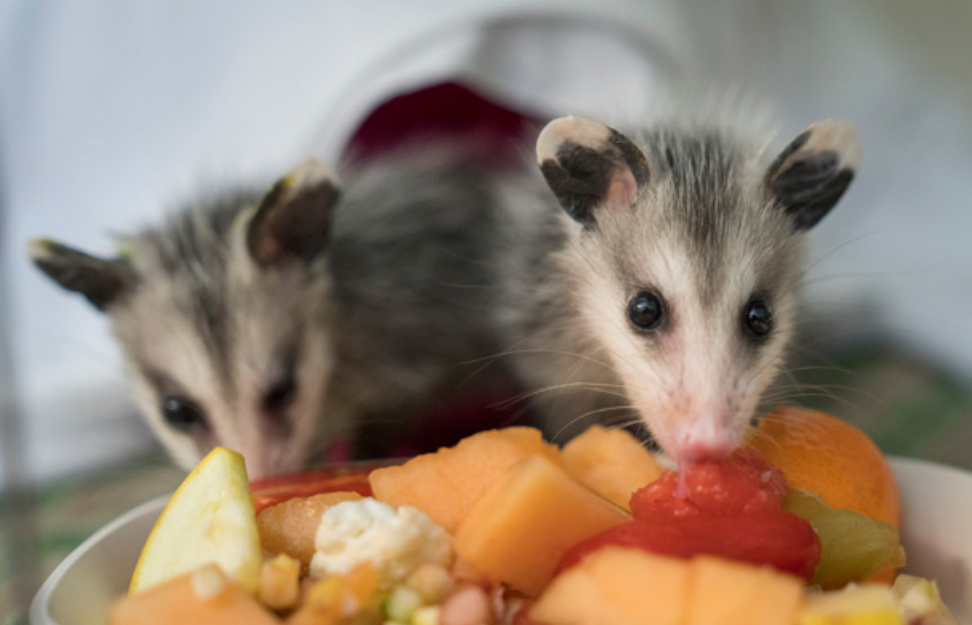

*People want to come to the aid of baby wildlife - help them understand whether and how they can.*

Pasadena Humane's flyers for [baby birds](assets/pdf/Baby-Bird-Flow-Chart-2021.pdf) and [baby mammals](assets/pdf/Baby-Mammal-Flow-Chart-2021.pdf).

**Contents**

- [Relevant Natural History](#relevant-natural-history)
- [Notes on Containment](#notes-on-containment)
- [Animal Injured by Cat](#animal-injured-by-cat)
- [Baby Bird](#baby-bird)
  - [Fell from nest](#fell-from-nest)
  - [Can't fly](#cant-fly)
- [Baby Deer](#baby-deer)
- [Baby Foxes or Coyotes](#baby-foxes-or-coyotes)
- [Baby Opossum](#baby-opossum)
- [Baby Rabbits](#baby-rabbits)
- [Baby Raccoon](#baby-raccoon)
- [Baby Skunk](#baby-skunk)
- [Baby Squirrel](#baby-squirrel)
  - [Fell from tree](#fell-from-tree)
  - [Following or trying to climb people](#following-or-trying-to-climb-people)
- [Bear Cub](#bear-cub)
- [Duckling](#duckling)
- [Gosling](#gosling)

# Relevant Natural History

Is that seemingly helpless baby wild animal really abandoned? In spring and summer, people frequently find baby wild animals who fall from trees or mysteriously seem to appear, and they assume the babies are orphaned. To determine whether a baby is actually orphaned, you'll need to know the animal's approximate age, species and circumstances, and you'll want to get a sense of how accurately the caller is interpreting the animal's behavior. Some animal mothers leave their young alone for long time periods (deer, rabbits) while others closely supervise them (raccoons). The tips below will help you determine whether a given animal is truly an orphan - and, if so, what to do.

# Notes on Containment

Callers **should**:

- Place animal in a secure, ventilated corner and keep them in a warm, dark and quiet place (assuming it is truly orphaned and/or injured and already in their possession)
- Keep noises to a minimum as loud noises can badly stress baby animals
- Wear heavy gloves when handling animals

Callers should **NOT**:

- Touch any baby wild animal
- Feed any baby wild animal (wrong foods like milk and lettuce can potentially kill them)

# Animal Injured by Cat

**REFERRAL:** Refer to a wildlife rehabilitator for help. Cat bites tend to become infected quickly and should be treated right away.

# Baby Bird

## Fell from nest

**ADVICE:** The caller should put the baby bird back in the nest if they can - it's a myth that parent birds will abandon babies if they've been touched. If the original nest is unreachable/destroyed and the babies are older nestlings (feathered and can maintain body heat):

- Place the babies in a wicker basket secured close to where the original nest was
- Wicker and other stick-like baskets resemble natural nests and prevent the birds' legs from becoming splayed while allowing rain to pass through so the birds don't drown
- The basket shouldn't be more than four inches deep - adult birds will not jump into something they can't see out of

The caller should watch carefully for at least an hour to make sure that the parents return to feed their chicks - parent birds can be very secretive, so they should glue their eyes to the nest! Let callers know that the presence of feces indicates that the bird is being fed.

More information in [Nestling Reunite Script](Nestling-Reunite-Script) and [Making a Nest](Making-a-Nest).

**REFERRAL:** Refer to a licensed wildlife rehabilitator if parent birds definitely don't return. 

## Can't fly

**ADVICE:** If the bird is almost full-sized and fully feathered but has short or seemingly no tail feathers, he's a fledgling who left the nest before he could fly. **This is normal**. The bird will spend a few days on the ground being fed by parents. The caller can check whether whitish/ gray-colored feces are on the ground around him. If so, that's a sign that the parents are feeding him, since baby birds defecate after being fed.

Instruct the caller to monitor from a distance and they'll usually see the parents return. They'll have to watch closely; birds can be quick and secretive. Fledglings are very vulnerable at this stage, so it's essential to keep all pets indoors during this period-especially [cats](#animal-injured-by-cat).

Examples in [Fledglings](Fledglings).

**REFERRAL:** Refer to a wildlife rehabilitator if the parents clearly aren't feeding the baby bird. 

# Baby Deer

**ADVICE:** Leave the baby alone. This is normal behavior. Mother deer carry a scent that can attract predators, but baby deer, called fawns, do not. So for the first month, a mother deer will leave her fawn alone the majority of the day for protection. The mother typically returns briefly twice a day, near dawn and dusk, to nurse her young. After about a month, the fawn will begin to venture out with her mother.

**REFERRAL:** If the fawn is wandering around and crying for hours, appears injured or is covered in flies, or if there is a dead doe (female deer) nearby, the fawn may be orphaned and the caller should contact a rehabilitator. 

# Baby Foxes or Coyotes

**ADVICE:** Fox kits and coyote pups will often appear unsupervised for long periods of time while both parents are out hunting. If the kits seem energetic and playful, tell the caller to let them be. When they're old enough to go on hunting trips with the parents, you'll see them less often.

**REFERRAL:** Refer to a rehabilitator only if the kits or pups appear sickly or weak, or if you have reason to believe that no parent is returning to care for them (or have evidence that both parents are dead).

# Baby Opossum

**ADVICE:** Baby opossums stay in their mother's pouch until they are three months old and the size of a mouse. At this age, they ride on her back and sometimes fall off without mom noticing.

**REFERRAL:** If the baby opossums are smaller than 7 inches long (not including tail), they are too young to be on their own. Refer the caller to a wildlife rehabilitator. If their body length is longer than 7 inches (not including tail), then they're big enough to be on their own.

# Baby Rabbits

**ADVICE:** If the nest is intact and the babies are not injured, advise the caller to leave them be! Like deer, mother rabbits only visit their young two to three times a day to avoid attracting predators. So finding babies alone in the nest is normal. If the nest has been disturbed, or if the babies might be orphaned, the caller can put a tic-tac-toe pattern of sticks, string or yarn over the nest to assess whether the mother is returning to nurse them. If the pattern is displaced or pushed aside but the nest is still covered 12 hours later, the mom has returned. Tell the caller not to touch the baby rabbits, as mother rabbits are very sensitive to foreign smells and may abandon their young if handled. 

**REFERRAL:** Refer to a wildlife rehabilitator if the tic-tac-toe pattern is undisturbed after 12 hours or if a [cat has had a baby in his mouth.](#animal-injured-by-cat) 

**NOTE:** It is vital to keep cats and dogs away from helpless young rabbits. Emphasize to the caller the importance of keeping cats inside, both for their own safety and for the safety of wildlife. Refer them to humanesociety.org/indoorcats for tips on how to make the transition.  

# Baby Raccoon

**ADVICE:** If the baby raccoon has been alone for more than a few hours, he has most likely lost his mother, since mother raccoons closely supervise their young and don't let them out of their sight much. When a mother raccoon has been trapped or killed, the hungry babies will start chittering and wandering away from their dens after about three days without mom. The caller can put an upside-down laundry basket over the baby (with a one-pound weight on top) and monitor it for a few hours. The caller must resist the urge to touch or pick up the babies and should ask around to see if anyone in the neighborhood trapped an adult raccoon or saw one hit by a car. 

**REFERRAL:** Refer to a wildlife rehabilitator if the mother doesn't try to retrieve her cub after a few hours. 

# Baby Skunk

**ADVICE:** Baby skunks are nearsighted and follow their mothers nose-to-tail. They sometimes lose sight of her when a car or dog scatters them. The caller must resist the urge to touch or pick up the babies and should put a plastic laundry basket upside down over the skunk to temporarily contain him while waiting for the mom to return. Advise the caller to approach the skunk slowly and talk softly. If the skunk gives a warning by stamping his front feet, the caller should stand still or back off. They can try to approach again after the skunk calms down. Then they should monitor from a distance to see whether the mom returns. The caller might want to ask around to see whether a neighbor has been trapping and recently took away an adult skunk (a common cause of "orphaned" skunk babies). 

**REFERRAL:** Contact a wildlife rehabilitator if the caller repeatedly sees the baby outside alone and/or a dead skunk has been found in the caller's yard or neighborhood.

# Baby Squirrel

## Fell from tree

**ADVICE:** If tree work was done recently, give the mother a chance to reclaim her baby (as long as he's uninjured) by leaving the baby at the tree base. They should not cover him with a blanket or put him in a deep box; the mother may not find him. If there are free-roaming cats or dogs around, they can put the squirrel in a berry basket or something similar with drainage and attach the container securely to the tree trunk as high as they can safely place it. The baby squirrel must remain within the immediate vicinity of where he fell or the mother will not find him.

- If it is chilly outside, or if the baby isn't fully furred, he'll need a heat source, such as a hot water bottle or a chemical hand warmer. Instruct the caller to place a piece of soft fabric, such as flannel, between the animal and the heating device and check to make sure both stay warm but not hot.
- Instruct the caller to give the mother an entire day to retrieve her young. It may take her that long to find him or make a new nest. Be sure to mention that they should not feed the baby-not only because babies require a specialized diet, but also because the baby's hunger cries will help attract Mom. 

**REFERRAL:** Call a wildlife rehabilitator if the baby isn't retrieved by dark (mother squirrels are not active after dusk). If the weather warrants, it is possible to bring the baby inside overnight and then attempt a reunion again early in the morning. 

## Following or trying to climb people

**REFERRAL:** Refer to a rehabilitator. This behavior indicates a juvenile baby squirrel who has lost his mother and needs help.

# Bear Cub

**ADVICE:** While bear cubs may wander away from mothers for a short while, the mom is usually pretty close by or looking for wayward cubs. A mother bear can be extremely protective and will not react well to people or pets close to her cubs. The caller should **NOT** approach the bear cub, who will typically be found soon by the mom. 

**REFERRAL:** If cubs are seen several days without the mother, seem to be in distress or are constantly vocalizing or approaching people, contact a state wildlife agency. Ensure that the caller does not offer food to any bear, as they have very specialized nutritional needs and can quickly become habituated to humans. 

# Duckling 

**ADVICE:** If the caller knows which pond the duckling came from, they should take him back to rejoin his family. If the duckling was left behind and his origin is unknown (e.g., he was fished out of storm drain or spillway), they can contain the duckling with an upside-down laundry basket and monitor from a distance to see if Mom returns. The mother will see the duckling through the lattice sides of the basket and make contact. If she returns, the caller should approach slowly and overturn the basket so the mom can collect her young. 

**REFERRAL:** If the mother does not return after several hours, contact a wildlife rehabilitator. 

# Gosling

**ADVICE:** The caller should try to reunite the gosling with her family if possible. If this isn't possible, know that Canada geese will accept unrelated goslings and raise them as their own; the caller can try releasing the gosling close to a goose family with similarly aged young. Monitor from afar to ensure the gosling is accepted. As a last resort, contact a wildlife rehabilitator.