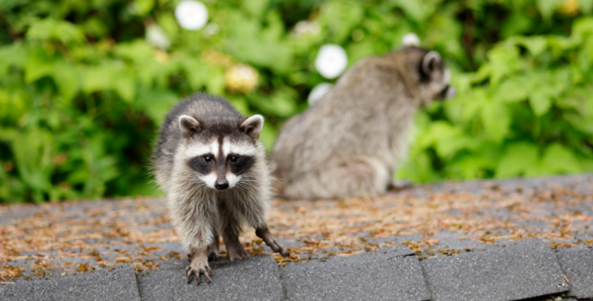

*Conflicts with raccoons come in many shapes and sizes, but all can be resolved humanely.*

**Contents**

- [Relevant Natural History](#relevant-natural-history)
- [Raccoon in the Trash Can](#raccoon-in-the-trash-can)
- [Raccoon in Dumpster](#raccoon-in-dumpster)
- [Raccoon Seen in Daytime](#raccoon-seen-in-daytime)
- [Raccoon Disoriented, Falling Down, Circling or Showing Unprovoked Aggression](#raccoon-disoriented-falling-down-circling-or-showing-unprovoked-aggression)
- [Raccoon Eating Pet Food](#raccoon-eating-pet-food)
- [Raccoon in Bird Feeder](#raccoon-in-bird-feeder)
- [Raccoon in Garage](#raccoon-in-garage)
- [Baby Raccoon Following People](#baby-raccoon-following-people)
- [Raccoon Coming Through Cat or Dog Door](#raccoon-coming-through-cat-or-dog-door)
- [Raccoon Eating Fish Out of Pond](#raccoon-eating-fish-out-of-pond)
- [Raccoon Damaging Lawn](#raccoon-damaging-lawn)
- [Raccoon in Chicken Coop](#raccoon-in-chicken-coop)
- [Raccoon Under Deck](#raccoon-under-deck)

# Relevant Natural History

Raccoons are intelligent and highly adaptable mammals. They are primarily nocturnal, but they may be active during the day, especially when caring for their young. Suburban and urban landscapes suit them perfectly. Chimneys and attics provide great denning sites; pet food and trash left outside provide a free buffet. They adapt easily to our lifestyles, yet people often have wrong ideas about raccoons - for example, that a raccoon seen during the day must have rabies. Raccoons are very beneficial animals; they provide free pest control by eating things some people don't like, such as bugs, grubs, small snakes, mice, and even baby rats. People also wrongly assume that raccoons are vicious animals, not realizing that healthy raccoons don't take on opponents much bigger than a mouse. Of course, like any animal, they'll try to defend themselves if cornered.

# Raccoon in the Trash Can

**ADVICE:** Uncovered trash cans provide an open invitation to hungry raccoons. Trash must be well-contained to stop garbage raids. Callers can secure trash lids with bungee cords, get an Animal Stopper brand trash can (equipped with built-in bungee cords), put the garbage out the morning of trash pickup, or get an outdoor storage enclosure for trash cans from a home-building store. [Trapping won't solve the problem](WCG-Why-not-trap-and-relocate); as long as there's a food source, the raccoon will return to it.

# Raccoon in Dumpster

**ADVICE:** The raccoon smelled good things and jumped into the dumpster, but now she's stuck because she can't climb the slippery sides of the dumpster to get out! Tell the caller to provide an exit route: Put a strong branch (2 inches in diameter or larger) or plank-like piece of wood in the dumpster at a 45-degree angle so the raccoon can climb out. Emphasize that the branch must run from top to bottom and be thick enough to support her weight. Assure the caller that the raccoon won't jump out and bite them; she will huddle nervously in the corner. If public dumpster lids are left open all the time, encourage the caller to post a big sign advising people to keep the lid closed so animals don't keep getting trapped inside.

# Raccoon Seen in Daytime

**ADVICE:** This is not necessarily cause for alarm. Raccoons are active by day when people leave out pet food or when the raccoons have hungry young to feed.

**ACTIONABLE:** Assess whether the raccoon is acting strangely - is she circling, dragging herself, or acting injured, lethargic, unresponsive, or unusually aggressive? If yes, dispatch an officer for assistance.

# Raccoon Disoriented, Falling Down, Circling or Showing Unprovoked Aggression

**ACTIONABLE:** Dispatch an officer to handle the situation.

# Raccoon Eating Pet Food

**ADVICE:** It's no wonder raccoons are responding to the free buffet. Who wouldn't? The best solution is to feed pets indoors. If pets must be fed outside, the caller should be advised to feed them only at a certain time in the morning or midday, then quickly take away any uneaten food. Pets will get used to the new schedule and modify their behavior accordingly. [Trapping the raccoon won't help](WCG-Why-not-trap-and-relocate). Other wild animals will be attracted to the pet food, and baby raccoons will be left behind to starve if their mother is trapped.

# Raccoon in Bird Feeder

**ADVICE:** There are effective squirrel baffles that also work to keep raccoons out. A good one is shaped like a stovepipe and placed on the pole portion of the bird feeder. It allows the raccoon to climb up the pole and into the closed pipe, but prevents her from going further. The pipe must be at least 24 inches long to prevent the raccoon from climbing over it and set at least 4 feet off the ground (up to the bottom part of the baffle) to keep her from jumping over it.

# Raccoon in Garage

**ADVICE:** If a raccoon wandered in through an open door, remove access to food, birdseed bags, or trash. Open the garage door before dusk, sprinkle an 8-inch band of white flour under it, and watch for exiting footprints. Close the door once the raccoon is gone. If this problem occurs in spring or summer, and the garage door has been open for a longer period, it is most likely a mother with babies. She is likely to be in the rafters or on a high shelf with her cubs, and you don't want to separate her from her babies. In this case:

**SELF-HELP OPTIONS:** Let them stay until they leave on their own (the kindest and best option) or evict them by placing vinegar-doused rags and a blaring radio in the garage near the den site. It may take the mother a while to find a new den and move her cubs, however. Typically, moms will move their young in response to harassment, but she may be resistant to leaving right away.

A nuisance wildlife control specialist can be called, but it's vital for the caller to emphasize they want the family evicted, not trapped and killed or trapped and relocated. Unfortunately, many nuisance wildlife control businesses routinely kill or relocate wildlife, so we don't recommend this option.

# Baby Raccoon Following People

**REFERRAL:** Refer to a wildlife rehabilitator. He's likely a hungry orphan who will follow anything that moves, but he could also be sick.

# Raccoon Coming Through Cat or Dog Door

**ADVICE:** The best solution is to feed pets indoors and not use a pet door. However, if the caller must have a pet door, recommend that they purchase a strong, electrically controlled door that only lets their designated pet in through a signal transmitted by her collar. These doors can be found at local pet supply stores.

# Raccoon Eating Fish Out of Pond

**ADVICE:** It is difficult to have a delicacy like fish in an area and expect raccoons not to notice! The best solution is to maintain a higher water level (at least 3 feet deep) and stack cinder blocks, large rocks, or ceramic pipes in the bottom of the pond so the fish can escape from the raccoon and take refuge.

# Raccoon Damaging Lawn

**ADVICE:** When it rains heavily or a lawn is over-watered, grubs come to the surface-where raccoons smell them and start digging. Once the lawn dries out - and if homeowners are careful not to over-water - the grubbing should cease. Callers can apply natural products like Grub Away Nematodes (gardensalive.com) or Milky Spore (found in gardening/landscape/home improvement stores) to the lawn to reduce grub numbers; they are very effective if applied properly (i.e., watered into the ground and applied at the right time of year). Callers can also sprinkle cayenne pepper or non-toxic capsaicin-based repellents on localized digging areas for a temporary effect.

# Raccoon in Chicken Coop

**ADVICE:** The only effective way to protect chickens is to reinforce the coop so raccoons can't get in. Explain that chickens, eggs, and supplemental feed like corn (which attracts rodents) will continually attract wildlife, so it's important to boost their coop's security. Any part of the structure not enclosed by wood - including window openings and doors - should be covered or reinforced with wildlife-proof mesh. Chicken wire alone is not wildlife-proof. Instead, use 16-gauge 1-inch-by-1-inch galvanized welded wire to prevent raccoons from reaching through or breaking the wire mesh. Although it's an inconvenience, once an animal enclosure is reinforced and maintained, the problem is permanently solved.

# Raccoon Under Deck

**ADVICE:** If it's spring or summer, it's likely to be a mother with her young. Raccoons move to multiple den sites within their home range for many reasons. The family may leave on its own, but if tolerance is not possible, harassment can speed up the process. It's also possible to evict the raccoon using a one-way door (which allows animals to exit but not enter) and attach wire mesh in an L-shaped design (to prevent them from digging back in).