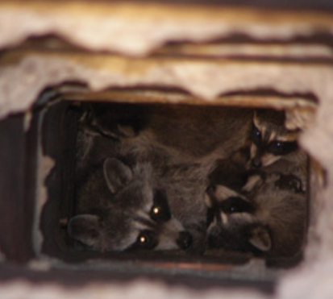

*To ensure a wildlife control operator uses humane practices, we recommend using a specific set of guidelines.*

If animal care and control, wildlife rehabilitators, and government agencies refer calls to nuisance wildlife control operators (NWCOs), we strongly recommend that you use the following guidelines. Their objective is to elicit assurances from the NWCO that their practices will be responsible and humane. It is important that your agency insists that the practices of any wildlife control company are in accord with your humane mission, since companies providing wildlife control services are often only lightly regulated. In addition to reviewing these guidelines with the operator you intend to refer, you may wish to have a written and signed statement of agreement. It is helpful as well to do a ride-along with any NWCO to whom you give referrals so you can evaluate their practices firsthand. These guidelines will help your agency and your constituents determine whether a company will follow humane approaches, help protect the public from questionable business practices, and provide a better chance of a lasting and environmentally responsible resolution to the wildlife conflict.

# Suggested Agreements Regarding NWCO Practices

1. Receive assurance that the Company’s practices comply with federal, state, and local laws and regulations. Make sure that they have the required permits, licenses, and appropriate levels of insurance to conduct control activities in your jurisdiction.

2. The Company will provide a full site inspection to identify all wildlife entry points as well as other potential sources of conflicts. Merely trapping the animal will not solve the problem if the attractant remains - other animals will quickly replace those who are removed. The Company should provide an on-site inspection and assessment to diagnose the problem that will include physically inspecting rooflines, attics, foundations, and relevant elements of the structure.

3. The Company will inform homeowners about non-lethal options and provide information about the use of eviction and exclusion methods to resolve the problem for the long term. Ensure that the company provides a full range of wildlife-proofing, exclusion, and prevention services (e.g., install chimney caps, repair holes). The NWCO’s goal must be to address the source of the problem (an open entry point or food source), not just the symptom (the animal). For animals in structures, insist on the use of exclusion strategies involving one-way doors and/or hands-on removal and reunion of families on-site.

4. Information should be presented in a firm written quote for work that addresses both the immediate conflict and any additional problems found. The work should come with a guarantee against re-entry by the animals. It is inadvisable to sign a contract with an open-ended clause that allows a company to charge for the removal of any wild animal captured on the customer’s property. This is unrelated to the customer’s problem, as well as unnecessary, expensive, and unethical.

5. The Company will demonstrate a commitment to humane capture and handling techniques. When removing animals from inside a structure and in the use of live-catch box traps, operators must use methods that reduce stress and keep animals from unnecessary harm. If live-catch box traps must be used, traps will be checked at least once daily, covered appropriately, and not be set in bad weather (such as extremes of heat or cold or predicted heavy precipitation) unless the trap is protected within a dwelling. The Company will encourage homeowners to allow on-site release so the animal remains in his own habitat and has the best chance of survival. If a trap must be used, NWCO will check all trapped mammals prior to release for signs of lactation (enlarged nipples) during the birthing and rearing seasons (spring-fall) to ensure that a mother is not separated from her young and that the young are not left behind to starve.

6. The Company will use methods that prevent the orphaning of dependent young. Since the bulk of NWCO work occurs during wildlife birthing and rearing seasons, NWCOs should adhere to the following protocols:

   a. The NWCO will do a thorough inspection to see if young are present.

   b. If young are found, the NWCO will encourage the homeowner to give the animal family a “grace period” (i.e., let the mother raise her young and leave on their own), as long as the animals are not damaging the house or property or creating any human health or safety risk.

   c. When a grace period is not possible:
   - If the babies are not yet mobile (i.e., not yet following the mother during outdoor forays), the operator will hand-capture the babies to be reunited outside (on-site) and use an appropriate method, such as a one-way door, to encourage the mother to self-evict. Or the NWCO will use harassment to encourage the mom to relocate young and will confirm the mother and all young are no longer within the structure before proceeding with the exclusion of the entry point.
   - A one-way door should be used only if the young are mobile enough to leave with the mother or if they can be placed outside near the one-way door or in an appropriate reunion container for the mother to retrieve them.

   d. Every reunion effort will adhere to the following standards:
   - Extremely young animals (eyes closed, barely furred) will be provided with a heat source - such as a heating pad wrapped in a towel - when placed for retrieval so they don’t become compromised and then die or get rejected by parent(s).
   - The young will be placed in a reunion box immediately outside the entry hole, den, or one-way door, or on the ground (if parent(s) in the immediate area) for the mother to retrieve. The young will be monitored to ensure retrieval. Reunion boxes must contain the babies but have a doorway that the mother can push through to get her young. The box or container must be placed in an appropriate spot shielded from heat, out of reach of predators, and at the appropriate time of day when the parent is active. Many animals won’t find their young if the babies are not left at the den/nest site or extremely close to it.
   - If the young are not retrieved, the NWCO will make every effort to take the orphan(s) to a wildlife rehabilitator for placement.

7. The Company will not use inhumane capture or killing methods such as drowning, car exhaust, acetone injections, kill traps (conibear traps, neck snare devices), glue traps, poisons, or smoke bombs. All animals can be released on-site in every state and no state requires that animals have to be killed.

8. The Company will only euthanize animals if they are mortally injured, sick, or endangering public safety.

**NOTE:** With rabies-vector species (e.g., raccoon, skunk, fox) the NWCO usually has two options according to state policies: to release on-site or euthanize. The NWCO should make every attempt to release (with the homeowner’s permission) and seal off the animals’ denning cavity rather than killing healthy animals. Acceptable euthanasia methods are those approved by the American Veterinary Medical Association, which include: Carbon dioxide chamber (CO2), proper carbon monoxide (CO) chamber (NOT car exhaust), gunshot where firearm discharge is legal, or lethal injection by a veterinarian. The NWCO must agree to follow the most recent AVMA Guidelines on Euthanasia (see most recent Euthanasia Panel Report of the AVMA) excepting any extenuating circumstances that involve human health or safety.

*People may be surprised to find raccoon families denning in their chimney, yet this is a rather common occurrence. We urge people to cap their chimneys if they don’t want unexpected guests, even if this is just a temporary fix until the final and more major repair can be done by a professional.*