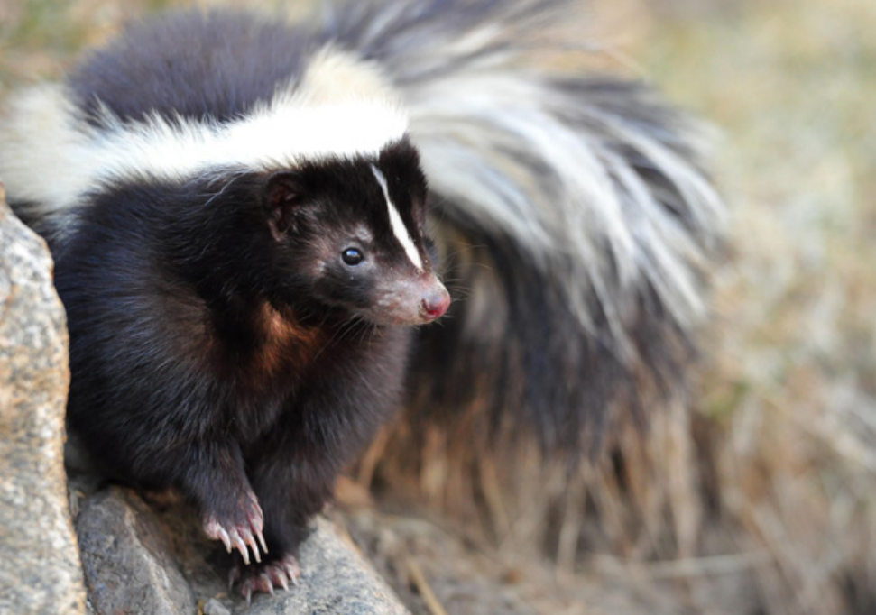
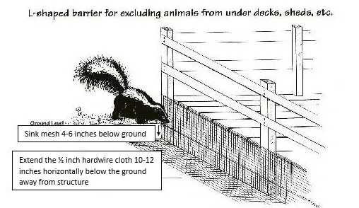

*The fear of getting sprayed can lead to panicked calls and overreactions.*

**Contents**

- [Relevant Natural History](#relevant-natural-history)
- [Skunk Seen in Daytime](#skunk-seen-in-daytime)
- [Adult Skunk Following People, Disoriented, Falling Down, Circling or Acting Aggressive](#adult-skunk-following-people-disoriented-falling-down-circling-or-acting-aggressive)
- [Sprayed by Skunk](#sprayed-by-skunk)
- [Baby Skunks Around Dead Mother](#baby-skunks-around-dead-mother)
- [Bad Odor in House](#bad-odor-in-house)
- [Skunk in Garage](#skunk-in-garage)
- [Skunk Eating Garbage](#skunk-eating-garbage)
- [Skunk in Window Well](#skunk-in-window-well)
- [Skunk with Head Stuck in Yogurt Cup or Other Food Container](#skunk-with-head-stuck-in-yogurt-cup-or-other-food-container)
- [Skunk Fell into Pool](#skunk-fell-into-pool)
- [Skunk Damaging Lawn](#skunk-damaging-lawn)
- [Skunk in Garden](#skunk-in-garden)
- [Set a Trap for a Woodchuck but Caught a Skunk](#set-a-trap-for-a-woodchuck-but-caught-a-skunk)
- [Skunk Under Deck](#skunk-under-deck)
- [Why Not Set a Trap?](#why-not-set-a-trap)

# Relevant Natural History

Gentle animals who tend to be nocturnal, skunks are sometimes out during the day. They have a tough time in our suburban and urban landscape. Because of their extreme nearsightedness, they are prone to falling into uncovered window wells and other similar pit-like perils from which they are unable to escape because of their limited agility. It's well-known that skunks have a noxious-smelling spray that they use to defend themselves, but it's less commonly known that they can't "reload" quickly and that they will not spray unless they feel really threatened. So before escalating to this drastic option, they will stamp their front feet as a warning, giving you ample opportunity to back off. Skunks are extremely beneficial creatures, and their important ecological role is often overlooked because of myth and stigma surrounding their spraying abilities. They provide free pest control by eating things many people don't like, including bugs, mice, and even baby rats.

# Skunk Seen in Daytime

**ADVICE:** This behavior by itself is not cause for alarm. Skunks are sometimes active by day when people leave out pet food or when adults have hungry young to feed. Ask the caller to monitor the skunk's behavior.

**ACTIONABLE:** Assess whether the skunk is acting strangely - ask the caller whether he's circling, dragging himself, acting injured, or seeming unusually aggressive. If he is, dispatch an officer to assess and handle the situation.

# Adult Skunk Following People, Disoriented, Falling Down, Circling or Acting Aggressive

**ACTIONABLE:** Dispatch an officer for assistance.

# Sprayed by Skunk

**ADVICE:** Provide the caller with this effective recipe for quickly de-scenting:

- A quart of hydrogen peroxide
- 1/4 cup of baking soda
- A teaspoon of liquid dish soap

Mix the ingredients in a large bowl. Apply with a washcloth, rinse, and then shampoo the person/pet (or anything that was sprayed). The odor will disappear within minutes. The pet may have bad breath for a while, though, if it was sprayed in the face. Remind the caller to keep their dog on a leash. The curiosity of an off-leash dog can lead to his peril!

# Baby Skunks Around Dead Mother

**REFERRAL:** Refer to a licensed rehabilitator. In the meantime, ask the caller to put an upside-down laundry basket over the baby skunks so they don't wander off.

# Bad Odor in House

**ADVICE:** A vial of Odors Away can be purchased from a hardware store to neutralize the smell. Put a few drops in a bowl and place it in a smelly room. Add new drops every day. If the odor persists for weeks, it may be caused by a dead skunk - advise the caller to seek professional assistance.

# Skunk in Garage

**ADVICE:** Skunks wander into garages when the door is left open. To get them out, instruct the caller to open the garage door just before dusk, sprinkle an 8-inch band of flour under it, watch for exiting footprints, and then close the door. Make sure the caller understands the timing; many people leave the garage door open all day, when the skunk is sleeping, then close it at dusk, just when the skunk would be waking up and trying to get out!

# Skunk Eating Garbage

**ADVICE:** Contain the trash better so that other animals are not able to push cans over or spread trash on the ground for the skunk to find. The caller can secure trash lids with bungee cords, get an Animal Stopper trash can (which has built-in bungees), put the garbage out the morning of trash pickup, or get an outdoor storage container for trash cans from a home-building store. Trapping won't solve the problem; as long as there's a food source, animals will keep being attracted to it.

# Skunk in Window Well

Skunks fall into window wells because they don't see well, and then they get stuck because they're poor climbers.

**SELF-HELP OPTIONS:** The caller can try putting a wide board slanted at a 45-degree angle into the window well if it isn't too deep. Attach a towel or mesh for traction. Another very effective option is to wear gloves and slowly lower a small rectangular plastic trashcan (with cheese inside as bait) into the well. Make sure the can is on its side so the skunk can easily walk into it. Then tip the can up a bit (so the skunk doesn't fall out while he's eating the cheese), raise it to ground level then slowly lower it on its side so the skunk can amble out. If you move slowly and talk softly, the skunk won't spray you - they respond to fast movement coming at them. Be sure to tell the caller they must get a window well cover (homemade or inexpensive from home-building stores) after the skunk is gone. Otherwise, this problem may occur again.

# Skunk with Head Stuck in Yogurt Cup or Other Food Container

**SELF-HELP OPTIONS:** If the caller is determined and capable of helping, tell them that the skunk won't spray anything he can't see, so the caller can grab hold of the food container while wearing gloves. Upon feeling resistance, the skunk will pull back and his head should pop out. Stand motionless - the skunk will usually blink a few times and then make a beeline for home. 

**REFERRAL:** Refer to a rehabilitator or dispatch an officer to help remove the food container if it is on too tight or if the caller is not willing to try the self-help option. Have the caller put a laundry basket or milk crate (with a heavy rock on top) over the skunk to keep him from wandering off. When his head is entrapped, he may run frantically into the street and cause car accidents or get hit.

# Skunk Fell into Pool

**ADVICE:** Skunks fall into pools fairly often because of their poor eyesight. The caller can put a pool skimmer or broom underneath him and gently lift him out. The skunk may be exhausted from swimming and may need some time to recover. If the skunk does not leave on his own after two hours, contact a wildlife rehabilitator. Consider adding a floating ramp to the pool so wildlife who accidently fall in can escape; commercial products include the Frog Log or Skamper Ramp.

# Skunk Damaging Lawn

**ADVICE:** When it rains heavily or the lawn is over-watered, grubs come to the surface where skunks smell them and start digging. Once the lawn dries out, and if the caller doesn't over-water, the grubbing should cease. Callers can apply natural products like Grub Away Nematodes (gardensalive.com) or Milky Spore (found in gardening/landscape/home improvement stores) to the lawn to reduce grub numbers; they are very effective if applied properly (i.e., watered into the ground and applied at the right time of year). Callers can also sprinkle cayenne pepper or non-toxic capsaicin-based repellents on localized digging areas for a temporary effect.

# Skunk in Garden

**ADVICE:** If the caller has a skunk in the garden, let them know that they're lucky! Skunks eat insect pests that plague gardens - Japanese and masked chafer beetle larvae included. The best one can hope for is that the skunk stays in the garden to perform this free insect control service. Because skunks focus on insects and don't bother with flowers or garden vegetables, they don't tend to cause problems.

# Set a Trap for a Woodchuck but Caught a Skunk

**ADVICE:** Assure the caller that they can let the skunk out without getting sprayed. Skunks have terrible eyesight and only spray when something comes at them fast, like a big dog who isn't paying attention to the skunk's warnings. If they move slowly and talk soothingly, they won't get sprayed. Skunks stamp their front feet as a warning when they're nervous, so if the skunk stamps, just remain motionless for a minute until he stops stamping, then proceed. The caller can slowly drape a towel over the trap prior to opening it, which creates a visual barrier that will calm both the caller and the skunk. Once the trap door is opened, the skunk will make a beeline for home. Emphasize to the caller that they should never leave traps open at night; otherwise, other skunks will surely wander into the trap.

**REFERRAL:** Dispatch an officer or refer to a rehabilitator to help release the skunk.

# Skunk Under Deck

Skunks will take advantage of cavities under decks and sheds to raise their young. However, they leave as soon as the young are old enough.

**ADVICE:** The simplest option is to wait for the skunks to leave on their own and then seal off their entry hole with 16-gauge 1-inch-by-1-inch square galvanized mesh. Trapping can result in starving young left behind. Callers can seal off the deck themselves using an L-shaped design, but it's critical to make sure that no animals are entrapped or babies are left behind to starve. See humanesociety.org/digginganimals for a description of what steps and precautions need to be taken.

# Why Not Set a Trap?

**ADVICE:** Trapping hardly ever solves wildlife problems. Even in studies where all the coyotes were trapped out of an area, others from the surrounding area quickly moved into the vacated niche. In addition, trapping often leads to starving young being left behind. It's much more effective to exclude wild animals from areas where they're not wanted rather than to continually remove all animals who may be attracted to a good food source or den/nest site (refer to [Why not trap and relocate](WCG-Why-not-trap-and-relocate) to help the caller understand the problems with trapping).