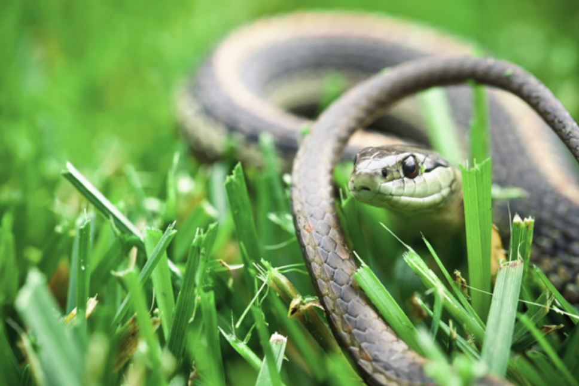

*Although many people are afraid of snakes, most are nonpoisonous and most try to avoid human contact altogether.*

Pasadena Humane's [Rattlesnake Flyer](assets/pdf/WildlifeFlyers-Rattlesnake.pdf).

**Contents**

- [Relevant Natural History](#relevant-natural-history)
- [Snake in Window Well](#snake-in-window-well)
- [Snake in Yard](#snake-in-yard)
- [Snake on Porch or Walkway](#snake-on-porch-or-walkway)
- [Snake in House](#snake-in-house)
- [Snake Bite](#snake-bite)

# Relevant Natural History

Snakes are extremely beneficial to their environments, helping to regulate rodent and rabbit populations. Despite a common fear of snakes among the public, these animals pose little actual danger. Of approximately 128 species of snake in the U.S., only 20 species are considered venomous, and most bites from venomous snakes are nonlethal. Bites from snakes most commonly occur when a person is trying to handle, move, or kill a snake or when a snake has been injured or threatened by human activity. Otherwise, snakes are elusive and avoid potential threats (including humans) by remaining still and relying on their camouflage. Most snakes have poor vision but are highly sensitive to vibration. They also have an auxiliary sense of smell, meaning they essentially smell with their tongue. Snakes are cold-blooded and must warm themselves with external sources, which is why people may find snakes sunning themselves on porches and sidewalks. In winter, snakes hibernate or become less active depending on the temperature.

**NOTE:** Most state wildlife agencies or extension offices have helpful identification resources online. This can help callers to identify the snake.

# Snake in Window Well

**ADVICE:** Insert a slanted board or thick branch in the window well and then leave the area, giving the snake the opportunity to climb out on her own. After the snake is gone, make sure to cover the window well to keep animals out. If the snake seems unable to get out, you can use a branch or long tool to try and help move her up the side of the wall and out.

# Snake in Yard

**ADVICE:** If the caller regularly sees a snake in their yard, that means their yard provides both shelter and a good source of food, namely rodents and insects. That's a good thing! Snakes are beneficial and should ideally be left alone. If the caller is still concerned, they can first try to identify the snake, which can be tricky since there are many "look-alikes" to venomous snakes. If the snake is non-venomous, the caller can stomp their feet 6-10 feet away from the snake and then move away so the snake can leave. If the snake is venomous, the caller should bring pets and children indoors. The snake does not need to be killed; he will likely leave on his own. After the snake is gone, the caller can remove attractants that draw in rodents by removing brush and woodpiles, sweeping up spilled birdseed under feeders, securing trash, fully enclosing compost, and cleaning up clutter around their home.

# Snake on Porch or Walkway

**ADVICE:** Snakes are cold-blooded and must warm themselves using external sources. This is why people often find snakes sunning on warm porches and sidewalks on cool days. Snakes are beneficial and should ideally be left alone. If the snake is non-venomous, the caller can stomp their feet 6-10 feet away from the snake and then move away so the snake can leave. If the snake is venomous, the caller should bring pets and children indoors. Remind the caller that the snake does not need to be killed.

# Snake in House

**ADVICE:** Most snakes who find their way into homes are rat snakes (also known as black snakes) looking for mice living inside. If the snake is visible, the caller should slowly and quietly move towards the snake and place a tall garbage can on its side next to him, then use a long broom to gently push the snake inside. Set the can upright and carry it outside to release the snake. If the caller saw the snake entering a hole, the caller should cover the opening. If the hole is on the outside of the house, a cone-shaped "excluder" made out of fiberglass window screen or similar mesh can be placed over the hole. The excluder should be about 2 feet long or more and come to a point so the snake can slither out but not climb back in. 

It can be difficult to locate snakes after first seeing them in the house; they often seem to disappear. They can sometimes be drawn out by placing a heating pad (set on low) on the floor. Check from a distance every few hours to see whether the snake has been drawn to the heat. Once the snake is visible, proceed to capture and remove the snake using the garbage can technique described above. The only way to prevent recurrence is to realize that the snake probably followed a food source - most likely a rodent - indoors. The caller should look around their house and seal openings, such as those found around washer/dryer connections, near pipe fittings under sinks, and by holes in closets and behind the stove.

# Snake Bite

**ADVICE:** If a non-venomous snake bite breaks the skin of a human or companion animal, the caller should treat the wound like any other puncture wound that can get infected and immediately consult a physician. The caller can consult the CDC to determine whether the snake is venomous by visiting cdc.gov/niosh/topics/snakes. If a venomous snake bites a human, immediately call 911 or transport the victim to the hospital. Instruct the victim to stay calm and inactive to slow the spread of the venom. Do not cut open the bite wound to bleed or suck out the venom. If possible, secure the snake for identification. If a venomous snake bites a companion animal, immediately transport the animal to the closest veterinary hospital. Keep the animal calm and inactive to slow the spread of the venom. Do not cut open the bite wound to bleed or suck out the venom. If possible, secure the snake for identification.