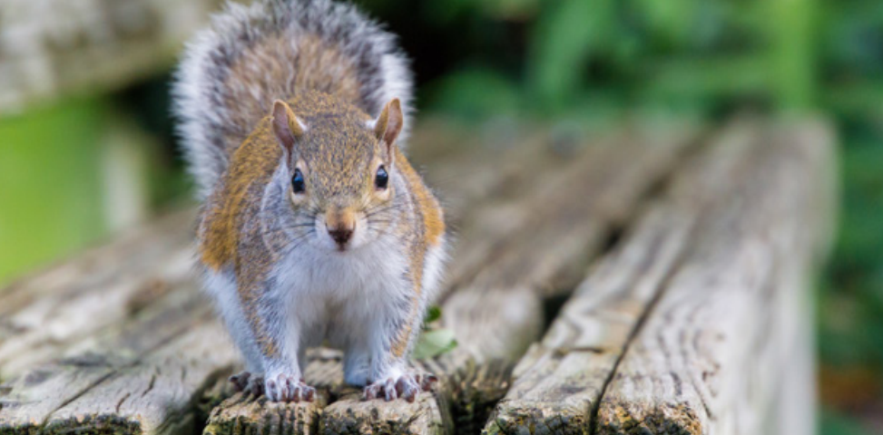

*Ubiquitous in suburban and urban areas, issues with squirrels can be addressed with patience and humane deterrents.*

**Contents**

- [Relevant Natural History](#relevant-natural-history)
- [Squirrel Raiding Bird Feeder](#squirrel-raiding-bird-feeder)
- [Squirrel Digging in Yard/Plants](#squirrel-digging-in-yardplants)
- [Baby Squirrel Following People/Trying to Climb a Person](#baby-squirrel-following-peopletrying-to-climb-a-person)
- [Squirrel Circling, Falling Over](#squirrel-circling-falling-over)
- [Squirrel Inside Living Space of Home](#squirrel-inside-living-space-of-home)
- [Squirrel in Attic, Roof or Walls](#squirrel-in-attic-roof-or-walls)
- [Squirrel in Chimney](#squirrel-in-chimney)
- [Baby Squirrel Fell From Tree](#baby-squirrel-fell-from-tree)
- [Squirrel in Trap](#squirrel-in-trap)
- [Why Not Set a Trap?](#why-not-set-a-trap)

# Relevant Natural History

Squirrels prosper in suburban and urban areas due to their supreme agility and adaptability. Gray squirrels are a familiar sight almost everywhere, yet not a welcome one when their quest for a suitable den leads them to take advantage of open attic vents to gain access to a wall or ceiling void in your house. Gray squirrels are active by day (diurnal), yet their more secretive cousins, flying squirrels, are active by night (nocturnal). Squirrels are high-strung animals, which is why they may behave erratically when trapped in an enclosed living space - they often run, frenzied, all over a house instead of merely going out an open door. Squirrels have two litters each year, in early spring and again in the late summer or early fall. If squirrels are heard scampering in the attic at those times of year, it’s most likely a mother with her babies.

# Squirrel Raiding Bird Feeder

**ADVICE:** Several specialized feeders and baffles are available to deter squirrels. One very effective commercially available baffle is shaped like a stovepipe and placed on the pole portion of the bird feeder. This allows the squirrel to climb up the pole and into the closed pipe but will not allow him around it. The pipe must be at least 15 inches long to prevent the squirrel from climbing over it and set at least 4 feet off the ground to prevent the squirrel from jumping over it.

# Squirrel Digging in Yard/Plants

**ADVICE:** Squirrels must bury nuts so they have a food source in winter. Although unsightly to some people, their digging of shallow holes won’t damage the lawn; it’s just a temporary cosmetic issue. Cayenne pepper or repellent products that contain capsicum can be sprinkled on the lawn or plants to prevent digging if absolutely necessary.

# Baby Squirrel Following People/Trying to Climb a Person

**REFERRAL:** Refer to a rehabilitator. This behavior indicates a juvenile baby squirrel who has lost his mother and needs to be taken to a wildlife rehabilitator. 

# Squirrel Circling, Falling Over

**ADVICE:** Squirrels are very susceptible to a parasite called roundworm, which creates rabies-like neurological symptoms once the parasite infects the animal’s brain. This condition is fatal and not treatable. Leave the animal alone. If people - particularly children - can’t be kept away, dispatch an officer.

# Squirrel Inside Living Space of Home

**ADVICE:** Squirrels inside a home usually get there by accident. They can be quite skittish and run everywhere but out the open window or door. To get them out, instruct the caller to shut the interior doors and open ground floor doors and windows. They can put some bread with peanut butter on window ledges or in front of the door to tempt them out, then go to another part of the house to allow the squirrel a chance to leave. Another option is to set a live trap baited with peanut butter near the squirrel and leave her alone for a few hours. Once the squirrel gets in the trap, the caller should immediately release her on site so she can get back to her young and stay in the habitat she knows. Traps can be obtained from hardware and home supply stores.

Once the squirrel is out, the caller should try to identify and close entry points. Tracks in soot around the fireplace or holes where daylight streams through the attic may offer clues as to how the squirrel got in. Before sealing up any hole or installing a chimney cap, the caller needs to ensure no animals are left behind, particularly babies. For more detailed instructions, visit humanesociety.org/squirrels.

# Squirrel in Attic, Roof or Walls

**ADVICE:** Squirrels in these areas usually have young. They have two litters a year, which means mothers care for babies spring through fall. The caller may want to contact a professional wildlife company to address the situation, but that should happen only after the babies are fully mobile and seen coming out of the house with their mother. At that point, they should insist the company use one-way doors to evict the squirrels rather than traps that kill or separate them and result in high mortality. Squirrels in attics can also be evicted by using scare devices like the Squirrel Evictor or a strobe light, yet their eviction must be followed up with closing any entry holes. As long as access points exist, squirrels or other animals will find their way back into the dwelling. However, before closing off any hole, it’s vital to ensure the cavity is no longer active by stuffing it with newspaper and seeing whether the paper is pushed in or out. After three days of no activity, the caller can assume the nest site has been abandoned.

# Squirrel in Chimney

**ADVICE:** The squirrel has most likely fallen in and can’t get out. Putting a thick rope down the flue, secured to the chimney, will enable the squirrel to climb out. If this is not feasible, it will be necessary to open the firebox doors and let the squirrel out of the house by shepherding him through an exterior door, but this may require the help of a wildlife expert. Squirrels get panicky in houses and may run anywhere except out an open door. If attempted, all interior doors should be shut and the area cleared so the squirrel has no choice but to exit out an open exterior door. Once the squirrel is out, emphasize to the caller that installing a chimney cap is the only way to prevent this situation from recurring. Before doing so, they should check for other squirrels and confirm that there was only one in the chimney.

# Baby Squirrel Fell From Tree

**ADVICE:** If tree work was done recently, give the mother a chance to reclaim her baby as long as he’s uninjured. Leave the baby at the tree base. Don’t cover him with a blanket and don’t put him in a deep box; the mother may not find him. The baby squirrel must remain within the immediate vicinity of where he fell. If it’s chilly outside, or if the baby isn’t fully furred, he’ll need a heat source, such as a hot water bottle or a chemical hand warmer. Tell the caller to place a piece of soft fabric between the animal and the heating device and check to make sure both stay warm. Be sure to give the mother an entire day to retrieve her young. It may take her that long to find a new nest site. Tell the caller not to feed the baby; you want his hunger cries to attract her. Sometimes mother squirrels don’t claim their young until just before dark. If the baby is not retrieved by dark, a wildlife rehabilitator should be called to help decide if the baby should be taken in overnight and a reunion attempted early the next day.

# Squirrel in Trap

**ADVICE:** Animals in traps are often highly stressed and should be released on site immediately. Explain to the caller that trapping and relocating squirrels creates problems; in spring and summer, babies are left behind to starve, and in winter a relocated squirrel is separated from the vital food cache (buried nuts) and will often starve. In addition, trapping rarely addresses the root cause of the problem. Instead, callers can safely release the squirrel by putting a towel over the trap (to create a visual barrier), pointing the trap away from dangerous areas and opening the door (while wearing heavy gloves) or propping it open with a book. If they refuse to let the squirrel out, it’s vital for animal control or a volunteer to respond so the animal is not left in the trap to suffer and die.

# Why Not Set a Trap?

**ADVICE:** Trapping hardly ever solves wildlife problems. Even in studies where all the coyotes were trapped out of an area, others from the surrounding area quickly moved into the vacated niche. In addition, trapping often leads to starving young being left behind. It’s much more effective to exclude wild animals from areas where they’re not wanted rather than to continually remove all animals who may be attracted to a good food source or den/nest site (refer to [Why not trap and relocate](WCG-Why-not-trap-and-relocate) to help the caller understand the problems with trapping).