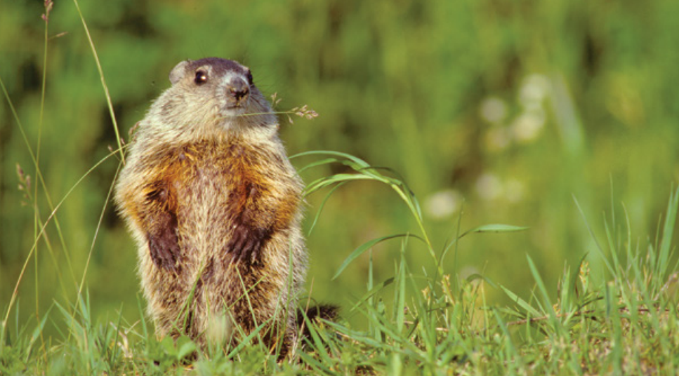

*Why trapping and relocating wild animals is not the humane choice the public thinks it is.*

It starts out mildly enough: Heading to work on the subway, you realize you forgot your wallet. No big deal, you think. I'll borrow money to get home.

Soon the lights go out and the train hurtles toward the sky, speeding through the atmosphere. Time passes - it's hard to tell how long. The subway is grounded, the doors swing open, and unfolding before you is a city you don't recognize. 

A few things are familiar - the Starbucks on every block, the cars, the English phrases on signs. But it's cold, you're hungry, you're penniless and the sun is setting. You think of your children who will be waiting to be picked up from school. Who will get them home safely? What will they eat for dinner?

With gathering dread, you notice a sinister-looking man eyeing you from a storefront. You want to escape but have no idea where to go. Where am I? you wonder, wracked with fear. What's happening?

Surprise! You've been trapped and relocated.

An unlikely scenario for most humans, the nightmare is a reality for many backyard creatures. The squirrel eating the birdseed, the fox near the shed, the groundhog munching the flowers, the opossum inspecting the compost pile - one minute they're going about the business of survival, and the next, without warning, they're whisked away from the only home they've ever known.

Many people who live-trap believe they've found a compassionate solution to home and garden woes. They set their captives free by a stream, a field, a grove of trees or some other human-conjured ideal that's usually a short drive away but might as well be in another galaxy for relocated animals. Upon arrival, these involuntary immigrants face such serious dangers that most are unlikely to survive long. One analysis looked at squirrels relocated from suburban yards to a forested environment. After just 88 days, 97% had died or disappeared. Research on other species shows similarly poor survival rates for wild animals who are forcibly relocated.

The squirrels "were getting nailed by predators because they didn't have escape routes," says HSUS senior scientist John Hadidian, who co-authored the study. "When a squirrel in your backyard is threatened by cats or hawks or other predators, they know exactly where to go. They have a map in their head of where they live."

Without that cognitive geography, relocated animals struggle to find food and den sites. Some die along the way or become ill from extreme stress. Once transported, animals may introduce disease to the new environment, some scientists believe. And too often, they leave behind something precious: their babies.

At the Cape Wildlife Center, Lynn Miller has seen her share of broken family units - including motherless fox kits delivered by a homeowner and baby raccoons orphaned after a nuisance wildlife control company trapped an adult nesting in a chimney. "That case especially bugged the heck out of me," says Miller, director of wildlife rehabilitation at the Massachusetts facility, operated by The Fund for Animals in partnership with The HSUS. "Owners want it fixed, and they want it fixed now, so they pay somebody megabucks to come in and trap and remove."

A cheaper, simpler solution of using light and sound to harass the mother would have been far more humane, says Miller. Since wild animals keep several alternate denning sites on reserve, the raccoon could have moved her babies to a safer space if given the chance. Instead, the family was needlessly split apart.

Aside from the negative effects on the animals themselves, trapping rarely solves conflicts. Sometimes animals left behind are juveniles still learning to find food and shelter; without parents as guides, they may turn to garbage and other human food sources, compounding the very problem a homeowner is attempting to address. And removing animals from an environment without considering what brought them there in the first place effectively puts out a vacancy sign, says Miller: "If one animal has found this area to be desirable, there's a good reason."

"The standard thought about nature is that it exists somewhere else, outside the perimeter of my house," says John Griffin, director of Humane Wildlife Services, an HSUS program that helps homeowners humanely remove animals from within or beneath structures and releases them into surrounding familiar territory with their families intact. "But animals don't recognize the difference between human-built habitat and  'natural' habitat. Habitat is habitat to them. If it can support them, if it has food, if it has shelter, it doesn't matter if a human built it. If it's a tree or a chimney or a shed, it doesn't matter."

In a society relatively out of sync with the rhythms of the natural world, however, the mere sight of a fox family under a porch can cause panic in people unfamiliar with the quiet ubiquity of foxes. Some homeowners have spent thousands of dollars trapping them, a practice so pointless Griffin likens it to trying to catch birds out of the sky. "Oftentimes foxes are here right under our noses," he says. "They're just so good at using marginal habitat that we don't even realize it."

Learning the natural history and behaviors of backyard species can go a long way toward living peacefully alongside them. While humane solutions to common problems exist, the kindest strategy of all - especially for wild animal families raising their young - is to watch, wait, enjoy and realize that animals are more like us than not. They need to feed their babies, avoid danger and stay warm. They aren't trying to take over our properties, steal our gardens, attack our children or invade our homes. From their perspective, this is their home, after all, and their world, too.

-Nancy Lawson

# Humane solutions

**GET SPECIES SMART:** Respect for those around us starts with greater understanding of their habits and needs. One of the most maligned backyard species - the opossum - is also the most benign. Beneficial to gardeners because of an appetite for insects and rodents often considered pests, they're also wanderers who typically den in other animals' burrows for short periods before moving on. "To do anything to a possum is just the silliest thing in the world," says John Griffin of Humane Wildlife Services. With a little perspective, we may realize we don't really have a problem at all.

**HUMANELY EVICT:** Waiting for nesting animals to leave on their own is preferable, but the next best strategy is to gently encourage them to move along to a new site. This is core to the philosophy of Humane Wildlife Services, which humanely excludes parents from re-entry into structures while helping ensure they can transport their young to alternate dens. For homeowners, gentle harassment techniques such as cider-vinegar-soaked rags, blaring radios and lights encourage unwanted house-guests to hit the road.

**RESHAPE THE ENVIRONMENT:** Once animals have moved on and it's clear that no babies are left in a given space, animal-proofing the structure is key to preventing the entry of more furry guests. Griffin's team adds chimney caps, seals porches and sheds, and helps homeowners create other barriers to re-entry. For gardeners, temporary or permanent fencing is the most effective deterrent.