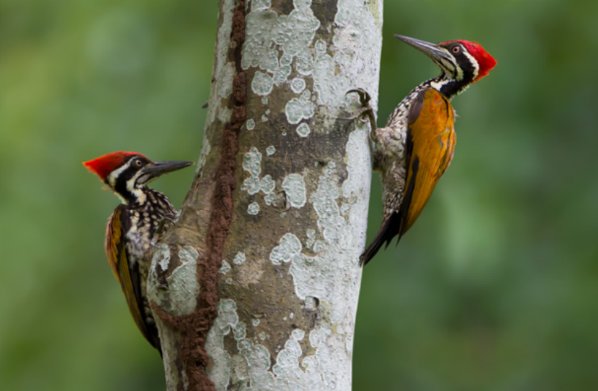
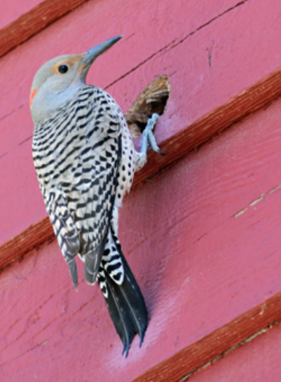

*Because woodpeckers are protected by the [Migratory Bird Treaty Act](https://www.fws.gov/law/migratory-bird-treaty-act-1918), callers will need to use humane deterrents to manage conflicts.*

**Contents**

- [Relevant Natural History](#relevant-natural-history)
- [Woodpecker Attacking House](#woodpecker-attacking-house)
- [Woodpecker Drilling Brick Mortar](#woodpecker-drilling-brick-mortar)
- [Woodpecker Nesting in a House's Siding](#woodpecker-nesting-in-a-houses-siding)
- [Woodpecker Putting Acorns in Fence Posts or Home's Siding](#woodpecker-putting-acorns-in-fence-posts-or-homes-siding)

# Relevant Natural History

One of the most recognizable sounds in nature is the rat-a-tat hammering of a woodpecker. Woodpeckers drill for several reasons: to excavate a nesting cavity, to find food (insects), to store food, or even to get a girl (unlike other birds, woodpecker males don't sing to attract females, they drum). Woodpeckers' stiff tail feathers and specially adapted toes with strong claws help prop them up on the tree trunks or branch as they work. Their bills, head, and neck are uniquely adapted for hammering, and many woodpeckers even have a long tongue that enables them to probe deep into the cavities of trees and dead wood to capture and feed on burrowing insects. But how can they cause all that noise without giving themselves a splitting headache? Fortunately, their skulls have special air sacs that cushion the brain from impact. Even the fine feathers around their nostrils help by filtering wood dust. When woodpecker conflicts occur, it is important to act early to prevent further damage and to break the problematic behavior cycle. Deterrents are the tool of choice to address conflicts, and you'll want to remind callers that woodpeckers - and their active nests - are legally protected by the [Migratory Bird Treaty Act](https://www.fws.gov/law/migratory-bird-treaty-act-1918). As such, the birds cannot be moved, harassed, or killed.

# Woodpecker Attacking House

**ADVICE:** Woodpeckers don't attack houses. Instead, they hammer on the home's wood to reach food or drum on metal areas to attract a mate and announce their territory. Excavating and exploring wood siding or trim boards for food often sounds irregular and occurs in different places around the house. Conversely, drumming for a mate is typically rhythmic, concentrated in one area that often contains something metallic (e.g., a metal gutter or metal siding) and heard in the spring. To figure out whether the woodpecker is hammering for food, the caller should check whether the wood is rotting or infested with insects like carpenter ants or carpenter bee larva. Although woodpeckers typically prefer decaying wood, an inexperienced juvenile might not know better.

If the wood is rotting and/or has wood-boring insects in it, the caller must address those issues in order to stop the activity and protect the house from potential water intrusion. If the wood is healthy, the caller should fill the holes with an appropriate putty and scare off the woodpecker. The most effective way to deter them is to hang 2-foot-long strips of Mylar reflective tape (such as Irritape) above the area. The intense reflection of prismatic light and loose ends moving in the wind will encourage them to move on. If the woodpecker is drumming for a mate, he will drill on a surface that allows for good reverberation, such as a metal chimney cap or gutter; his goal is to make as loud a noise as possible. Drumming rarely does damage to the area and usually ceases by the summer. If the activity is especially disruptive, the caller can use the techniques described above to ward off the woodpecker.

# Woodpecker Drilling Brick Mortar

**ADVICE:** Woodpeckers primarily peck at mortar for one of two reasons: to find grit to help process food or to access calcium in the mortar to make up for a mineral deficiency. Because it's impossible to know which one the bird is doing, the caller should act quickly before too much damage is done and before a habit is formed. To discourage pecking mortar for grit, place some sand on a nearby flat surface. This will provide an easier source of grit. To discourage pecking mortar for calcium, either put some finely crushed eggshells on a flat surface or in the bird feeder or purchase a calcium block (often sold at pet stores) and hang it on a nearby tree. Once the alternative grit and calcium sources are provided, the caller should repair the mortar and repel the woodpecker by hanging strips of Mylar reflective tape (such as Irritape) over the area or attach a Scare Eye balloon to the mortar area for a few days.

# Woodpecker Nesting in a House's Siding

**ADVICE:** Occasionally, woodpeckers will excavate a nest site in a home's wood siding or take advantage of a knot that has popped out (due to the wood drying out). The hole will be just big enough for the bird to enter. If this happens during the spring or summer, there is likely a nest with chicks inside. It is illegal to harass or move them during this period, so the caller must wait until the chicks have fledged (left the nest) before closing off the entry point. This typically occurs in mid to late summer. Once the caller has confirmed the chicks are gone, they can clear the nesting material and repair the hole.

# Woodpecker Putting Acorns in Fence Posts or Home's Siding

**ADVICE:** Acorn woodpeckers are famous for storing food, primarily acorns. They do this by drilling hundreds (sometimes thousands) of individual holes in a single tree, called a granary, and placing a single acorn in each hole. Although trees are preferred, they're not always available. So acorn woodpeckers will create a pseudo-granary in a fence post or house siding. The key is to catch the behavior quickly and to immediately install deterrents. In this case, the caller should hang 2-foot-long strips of Mylar reflective tape (such as Irritape) from the top of the area and allow the strips to move in the wind directly in front of the holes.