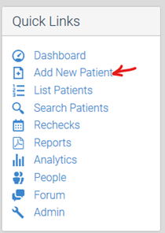
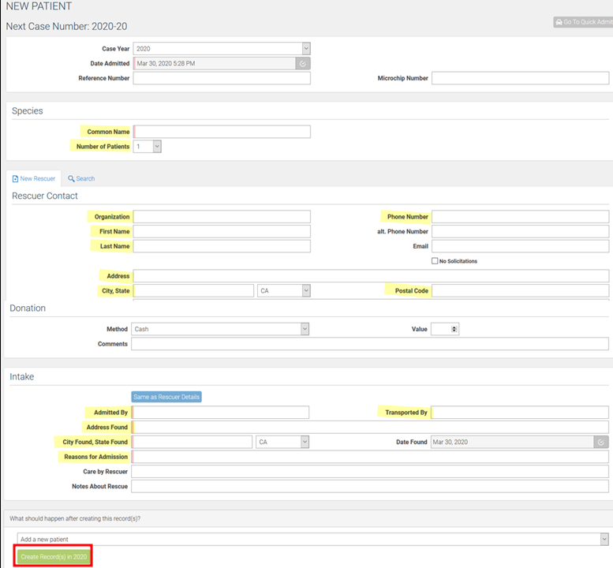

This is sourced from the [WRMD Documentations](https://wrmd.helpscoutdocs.com/article/56-how-to-admit-a-patient).

**Contents**

- [Step 1: Login](#step-1-login)
- [Step 2: Navigate to Add New Patient](#step-2-navigate-to-add-new-patient)
- [Step 3: Fill Out the Form](#step-3-fill-out-the-form)
  - [Assigning a Case Number](#assigning-a-case-number)
  - [Identifying the Species](#identifying-the-species)
  - [Adding Rescuer Information and Donations](#adding-rescuer-information-and-donations)
  - [Adding Intake Information](#adding-intake-information)
  - [Designate and Create Record(s)](#designate-and-create-records)
- [Step 4: Create Record(s)](#step-4-create-records)

# Step 1: Login

Visit https://www.wrmd.org/signin and log into your account using the username and password that you registered with.  

# Step 2: Navigate to Add New Patient

On the left side of the main navigation page, click on the Add New Patient link in the Quick Link box. You will be brought to the new patient screen.

# Step 3: Fill Out the Form

Fill out the new patient form. The case number is automatically generated, but the details need to be filled in by you. Type in the species type, rescuer contact, donation amount (if applicable), and reasons for intake.

Enter as much of the highlighted fields as possible.

## Assigning a Case Number

Each new patient is automatically assigned a case number which always begins with the current year and then the next numeric number for the patient to be admitted. For example, in a given year (let’s assume it’s 2020), if you are adding your twentieth patient of the year, the case number would be 2020-20.

## Identifying the Species

**Common Name:** The WRMD species database includes every species in the world, so as soon as you begin typing the species, or common name, of the animal admitted, WRMD generates an auto-suggestion list of what you are typing in, making it easy for you to choose the species name.

Note: WRMD’s species list generator gets smarter as you continue to input names into your account, generating the names you most frequently add to your account.

**Number of Patients:** This field allows you to designate how many patients you want to create. For example, if you are admitting 2 Red-shouldered Hawks together, WRMD will create two separate Red-shouldered Hawk patient records.

## Adding Rescuer Information and Donations

Fill in the appropriate fields with the contact information of the person or organization who brought in the patient. You can also include notes about that rescuer which may be helpful for you to know. By including their information, you effectively keep a history of all the animals a person has brought into your organization.

**Search Tab:** If the rescuer has brought in animals before, click the search tab and type in their identifying information. In the drop down list, choose the correct name and all of their information will populate the rescuer section.

**Donation Section:** If the person made a donation, you can record that in this section, along with any comments you wanted to make.

## Adding Intake Information

You are required to add intake information about the patient(s) being admitted. Fields include:

- Admitted by (this is the name of the person creating the record)
- Transported by (if the person who transported the animal differs from the rescuer) 
- Address Found (if the address details are the same as the rescuer, click the “Same as Rescuer” button)
- City Found, State Found (if the address details are the same as the rescuer, click the “Same as Rescuer” button)
- Date found (defaults to the current date)
- Reasons for Admission (why the animal is now in your care)
- Care by Rescuer (any care or treatment done by the finder/rescuer)
- Notes about Rescue (any note about the rescue itself)

## Designate and Create Record(s)

Before creating a record, you can designate what you want WRMD to do with it. By default, WRMD will create these patient records and return to "Add New Patient", but you have a few other options to choose from. 

- Add New Patient (Continue to add additional new patients. This is the default selection)
- View Patient’s Record (Takes you directly to the new patient record you just created)
- Batch Update Patients (Bulk updates all of the patients at the same time)

After clicking the Create Record(s) button, your next screen will confirm that you have created the record by displaying a green banner at the top of the page and your next case number will be available for the next patient.

# Step 4: Create Record(s)

Click the green Create Record(s) button at the bottom of the page.