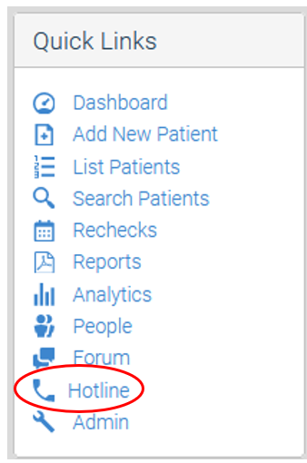
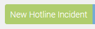
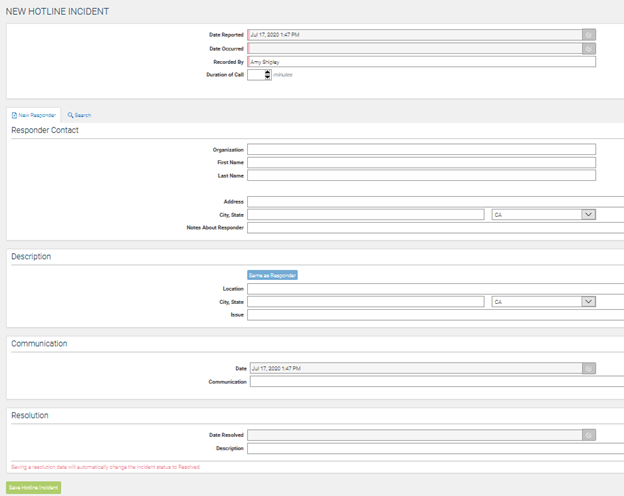
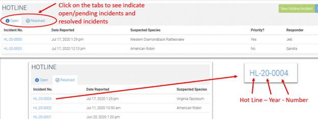

This is sourced from the [WRMD Documentations](https://wrmd.helpscoutdocs.com/article/77-how-to-create-a-hotline-incident).

**Contents**

- [Step 1: Login](#step-1-login)
- [Step 2: Navigate to Hotline](#step-2-navigate-to-hotline)
- [Step 3: Create New Hotline Incident](#step-3-create-new-hotline-incident)
- [Step 4: Fill Out the Form](#step-4-fill-out-the-form)
- [Step 5: Save the Hotline Incident](#step-5-save-the-hotline-incident)
- [Step 6: Hotline Incidents List](#step-6-hotline-incidents-list)

# Step 1: Login

Visit[ https://www.wrmd.org/signin](https://www.wrmd.org/signin) and log into your account using the username and password that you registered with. 

# Step 2: Navigate to Hotline

Click on the Hotline Link in the Quick Links tab.

# Step 3: Create New Hotline Incident

Click on the green New Hotline Incident button in the top right-hand corner.

# Step 4: Fill Out the Form

Fill in the relevant details about the call. 

There is information across five panels, but only fields that are lined with pink are required.

- **Incident Panel:** In this panel, record the date of the call, the date of the incident, and who responded to it. If the call is in reference to a sick, injured, or orphaned animal, fill in the suspected species, the number of animals, its urgency, category, and status. While not required, you may want to record the duration of the call as the analytic data you receive can help you to improve staffing and/or training.
- **Responder Contact:** Input the details of who is calling. The information you include here will be recorded under your [People data](https://help.wrmd.org/kb-article/managing-your-people-privacy-settings/). If the responder has never called before, include their information under the New Responder tab. If they have called before, you can use the Search tab to find their information.
- **Description:** Include the location of the incident and a description of it.
- **Communication:** In this panel, record any important details that you told the person.
- **Resolution:** Write one of the following if the issue is resolved (or leave it blank for developing incidents and update it afterwards):
   
   - Admitted
   - Diverted
   - Unresolved
   - Education

   **NOTE:** Be aware that if you include a date in the Resolution panel, the Status field in the Incident Panel will automatically change to Resolved.

# Step 5: Save the Hotline Incident

Click on the green Save Hotline Incident button.

# Step 6: Hotline Incidents List

Your Hotline Incidents will be saved as a list in the Hotline section. 

There will be two tabs: one is for open/pending incidents and the other is for resolved incidents. Each incident is given an incident number, which is chronological and numeric.

