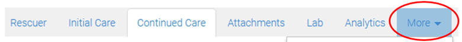
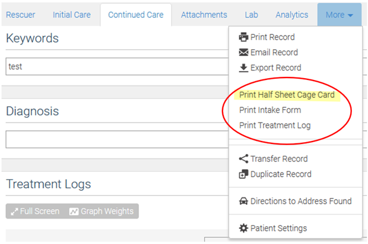

This is sourced from the [WRMD Documentations](https://wrmd.helpscoutdocs.com/article/92-paper-forms)

**Contents**

- [Step 1: Login](#step-1-login)
- [Step 2: Navigate to Patient Record](#step-2-navigate-to-patient-record)
- [Step 3: Click More](#step-3-click-more)
- [Step 4: Select and Print](#step-4-select-and-print)

# Step 1: Login

Visit https://www.wrmd.org/signin and log into your account using the username and password that you registered with.

# Step 2: Navigate to Patient Record

Open the Patient Record of the animal whose paper form you want to print. 

# Step 3: Click More

Click on the More tab.

# Step 4: Select and Print

Click Print Half Sheet Cage Card.

When you access the forms through the Patient Record, any information you have inputted into the Patient Record electronically will be printed along with the form.

